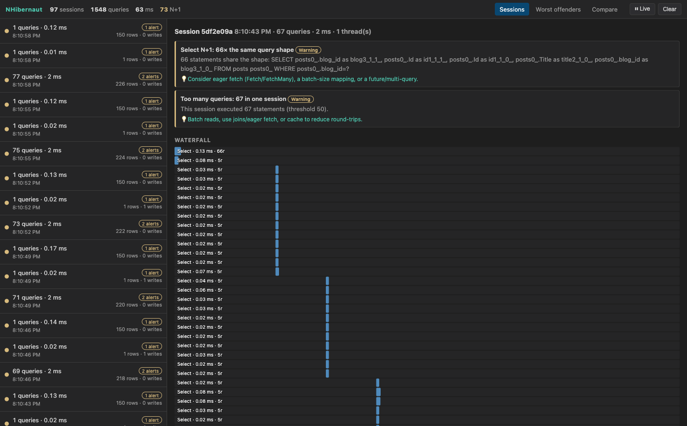

<p align="center">
  
</p>

# NHibernaut

A host-agnostic profiler for **NHibernate 5.x** that drops into *any* .NET application and gives you
NHibernate-Profiler-style visibility into what your data layer actually does at runtime: every
session, its connections and transactions, the SQL it ran (with parameters, timing, row counts), the
objects it hydrated, the writes it flushed — plus an analysis engine that flags common ORM
anti-patterns (Select N+1, unbounded result sets, cross-thread session use, …).

Results are viewable in a self-hosted, live web dashboard that the library stands up **itself** from
its own in-process `HttpListener` server — independent of the host application's web stack (if it
even has one).

> MIT licensed. Not affiliated with the commercial NHibernate Profiler.

📖 **Docs:** [User Guide](docs/USER_GUIDE.md) (dashboard walkthrough with screenshots) ·
[Architecture](docs/ARCHITECTURE.md) (how it works, with diagrams) ·
[Contributing](CONTRIBUTING.md) (build, test, extend)

## Why

- **Host-agnostic.** Works in a console app, worker service, Windows service, WPF/WinForms app,
  legacy ASP.NET app, ASP.NET Core app, or a test fixture — the same way. Add two NuGet references,
  enable with two lines.
- **Fail-safe.** Capture is wrapped end-to-end: an internal error is swallowed and routed to a
  diagnostic channel — it never throws into, materially slows, or changes the behavior of the host.
- **Session-centric.** The unit of work is the NHibernate session, not the physical connection.

## Supported frameworks

- **NHibernaut.Core** and **NHibernaut.Server** target **.NET 10**.
- **NHibernaut.AspNetCore** (optional) targets **.NET 10**.
- ORM: NHibernate 5.x (developed/tested against 5.6).

> Note: this build targets **.NET 10 only**. The original spec multi-targeted `netstandard2.0` for
> .NET Framework 4.x reach; that compatibility was intentionally dropped for this build.

## Quickstart (Tier A — recommended, works in any host)

Reference `NHibernaut.Core` + `NHibernaut.Server`, then:

```csharp
using NHibernaut.Core;     // EnableNHibernaut
using NHibernaut.Server;   // NHibernautServer

var cfg = new Configuration();
cfg.Configure();
cfg.AddAssembly(typeof(Foo).Assembly);

cfg.EnableNHibernaut();                 // capture (host-agnostic, lives in Core)

var sessionFactory = cfg.BuildSessionFactory();

NHibernautServer.Start();               // self-hosted dashboard at http://localhost:5005
```

`EnableNHibernaut` swaps in a profiling connection provider **and** driver (NHibernate creates commands
through the driver, so both are required), and appends the object-level event listeners. You can also
configure everything inline:

```csharp
cfg.EnableNHibernaut(o =>
{
    o.SlowQueryMs = 100;
    o.CaptureParameterValues = false;          // for PII-sensitive production
    o.Dashboard.Port = 6000;
});
```

A reference-only **Tier B** baseline also exists: a module initializer installs a logging hook that
captures SQL text (no timing/params/object data) even without calling `EnableNHibernaut`. Calling
`EnableNHibernaut` (Tier A) supersedes it. See *Security notes* for the caveat.

## Optional ASP.NET Core integration (Tier C)

If you'd rather mount the dashboard on your existing server (and not open a second port), reference
`NHibernaut.AspNetCore`:

```csharp
builder.Services.AddNHibernaut(o => o.Dashboard.EditorLinkScheme = "vscode");

app.UseNHibernaut();        // per-request scoping + Server-Timing / X-NHibernaut-RequestId headers
app.MapNHibernaut();        // mounts the dashboard + API at /nhibernaut
```

This adds a `Server-Timing` response header (total DB time + query count for the request) and an
`X-NHibernaut-RequestId` header so browser devtools and SPA clients can see per-call DB cost and
deep-link into the dashboard. The dashboard is hidden in Production unless
`Dashboard.EnabledInProduction` is set. You can also auto-wire it with no code via the hosting
startup: `ASPNETCORE_HOSTINGSTARTUPASSEMBLIES=NHibernaut.AspNetCore` and `NHIBERNAUT_ENABLED=1`.

> Tier C still relies on `cfg.EnableNHibernaut()` for capture — it adds request correlation, headers,
> and mounting.

## Alert catalogue

| Type | Severity | Rule (default threshold) |
|---|---|---|
| `SelectNPlusOne` | Warning | ≥ N statements sharing a normalized SQL shape, or ≥ N collection inits of one role, in a session (N = 10) |
| `TooManyQueries` | Warning | session statement count > 50 |
| `UnboundedResultSet` | Warning | a SELECT with no row-limiting clause returning > 100 rows |
| `TooManyRows` | Warning | a single statement returning > 1000 rows |
| `TooManyJoins` | Info | JOIN count in one statement > 5 |
| `SlowQuery` | Warning | statement duration > 200 ms |
| `DuplicateQuery` | Info | identical SQL **and** parameters executed > once in a session |
| `CrossThreadSession` | Error | one session observed on > 1 managed thread |
| `WriteWithoutTransaction` | Warning | Insert/Update/Delete executed outside any transaction window |
| `TooManyWrites` | Info | session write count > 50 |
| `SuperfluousUpdate` | Info | an UPDATE where no tracked property actually changed (best-effort) |

All thresholds live on `NHibernautOptions`. Each alert carries a human-readable description and a
concrete remediation suggestion.

## The dashboard

Devtools-styled, read-only, dense, monospace SQL, severity colors. The primary navigation unit is the
**session** (the request, when present via Tier C). See the **[User Guide](docs/USER_GUIDE.md)** for a
full walkthrough.



- **Waterfall timeline** — per-session horizontal bars scaled by start time and duration. An N+1
  shows up as an unmistakable staircase of identical short bars.
- **N+1 folding** — runs of the same normalized SQL collapse into one `×N` group, expandable.
- **"What did this statement do" panel** — on a selected statement: formatted SQL + parameter values,
  the objects it wrote by type and primary key (`created: Blog #1`, `updated: …`, `deleted: …`), then
  `hydrated: 47 × Server (#1, #2 …)` and `initialized: Server.Devices`. Write statements are also
  annotated inline in the list (`created Blog #1`).
- **Alert-first triage** — sessions sorted by max severity; each session leads with its alerts;
  clicking an alert highlights the offending bars.
- **Click-to-source** — the first app frame rendered as a `vscode://file/...` deep link
  (`EditorLinkScheme` configurable). Requires `CaptureStackTraces`.
- **Worst-offenders** — query shapes ranked by total time / call count / N+1 incidence.
- **Compare** — diff two sessions (query count, total time, alerts) from the in-memory buffer.
- **Live feed** — Server-Sent Events push new sealed sessions; pause + clear in the top bar.

### JSON API

`GET /api/sessions`, `GET /api/sessions/{id}`, `GET /api/aggregate`, `GET /api/alerts`,
`GET /api/stream` (SSE), `DELETE /api/sessions`, `GET /` + assets.

## Deploy the dashboard as a service

Besides hosting the dashboard in-process, you can install it as a standalone background **service**
from native OS installers (`.msi` / `.deb` / `.rpm` / `.pkg`) attached to each
[GitHub Release](https://github.com/cstaerkel/NHibernaut/releases). It runs a self-contained build
of `NHibernaut.Server.Host` (a Windows service / systemd unit / launchd daemon) serving the dashboard
at `http://<host>:5005`, configured via `NHIBERNAUT_BIND` / `NHIBERNAUT_PORT` / `NHIBERNAUT_AUTH_TOKEN`.
See the **[Install guide](docs/INSTALL.md)**.

## Security notes

The dashboard exposes **SQL and parameter values** — treat it as sensitive.

- Default bind is `127.0.0.1:5005` (loopback). Loopback avoids the Windows URL-ACL requirement.
- Binding a **non-loopback** address **requires** `Dashboard.AuthToken`; the server refuses to start
  otherwise. When a token is set it is enforced on **every** request (`X-NHibernaut-Token` header or
  `?token=`).
- The dashboard is dev-only by default; it is hidden in Production (Tier C) unless
  `Dashboard.EnabledInProduction`.
- Disable parameter capture (`CaptureParameterValues = false`) or provide a `ParameterRedactor` for
  PII-sensitive environments. `SamplingRate` (0..1) can reduce overhead in hot paths.
- **Tier B caveat:** the logging baseline installs a custom NHibernate logger factory on assembly
  load, which replaces NHibernate's logger factory for the process. By default NHibernate logs
  nothing, so this is transparent; if you configured log4net/NLog for NHibernate it is overridden.
  Tier A (`EnableNHibernaut`) is the recommended path.

## Samples

- `samples/NHibernaut.Sample.Console` — a console app that enables NHibernaut in two lines, self-hosts
  the dashboard, and continuously generates N+1 / writes / transactions to explore.
- `samples/NHibernaut.Sample.Web` — a minimal ASP.NET Core app demonstrating the optional Tier C
  integration.

## Building & testing

```bash
dotnet build
dotnet test
```

## Layout

```
src/NHibernaut.Core/        capture, model, analysis, storage, runtime, logging baseline (no web dep)
src/NHibernaut.Server/      independent HttpListener dashboard server + embedded SPA
src/NHibernaut.AspNetCore/  optional ASP.NET Core pipeline integration (Tier C)
test/NHibernaut.Tests/      unit + integration (SQLite in-memory) + server + SSE + Tier C tests
samples/                   console (self-hosted dashboard) + web (Tier C)
```
