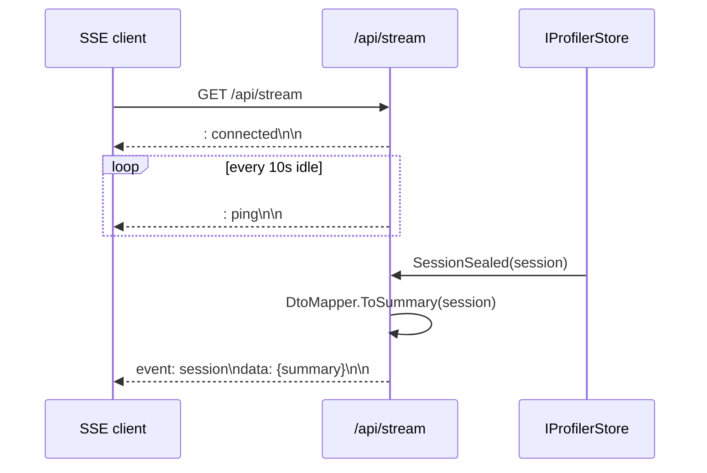
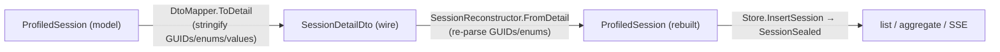

# NHibernaut — Dashboard HTTP API

The wire contract for the NHibernaut dashboard: the JSON API, the SSE live feed, the ingest endpoint,
and the embedded SPA. For how the server fits together, see Architecture
[§6 Dashboard server](ARCHITECTURE.md#6-dashboard-server) and
[§7 Remote ingestion](ARCHITECTURE.md#7-remote-ingestion-centralized-dashboard); for the dashboard UI,
the [User Guide](USER_GUIDE.md); for getting started, the [README](../README.md).

The **same API** is served by two transports over the **same** `DashboardApi` query logic:

| Transport | Host | Mount | Source |
|---|---|---|---|
| `NHibernautServer` | self-hosted `HttpListener` (no web framework) | root `/` | `NHibernaut.Server/NHibernautServer.cs` |
| Tier C (`MapNHibernaut`) | the host's ASP.NET Core pipeline | under a path (default `/nhibernaut`) | `NHibernaut.AspNetCore/DashboardEndpoints.cs` |

Routes, query params, status codes, and DTOs are identical across both. The two transport-specific
differences are called out in [Tier C differences](#tier-c-differences). Paths below are written
relative to the mount: under Tier C, prefix them with the mount path (e.g. `/nhibernaut/api/sessions`).

JSON is serialized with `JsonSerializerDefaults.Web` (**camelCase**, unindented). All wire DTOs render
values as **display-ready strings** — see [DTO schemas](#dto-schemas).

---

## Endpoint reference

One row per real route, taken from the routing tables in `NHibernautServer.Route` and
`DashboardEndpoints.HandleAsync`. Anything not matched by a route, plus any unmatched `GET`, behaves as
noted in the last two rows.

| Method | Path | Query params | Auth | Returns | Status |
|---|---|---|---|---|---|
| `GET` | `/api/config` | — | token if set | `{ editorLinkScheme }` | `200` |
| `GET` | `/api/sessions` | `take` (int, default `50`), `since` (DateTimeOffset), `minSeverity` (`Info`\|`Warning`\|`Error`) | token if set | `SessionSummaryDto[]` | `200` |
| `GET` | `/api/sessions/{id}` | — (`{id}` = session GUID) | token if set | `SessionDetailDto` | `200`, `400` bad GUID, `404` not found |
| `GET` | `/api/aggregate` | — | token if set | `AggregateRowDto[]` | `200` |
| `GET` | `/api/alerts` | `take` (int, default `100`) | token if set | `AlertFeedItemDto[]` | `200` |
| `GET` | `/api/stream` | — | token if set | SSE stream (`text/event-stream`) | `200` |
| `POST` | `/api/ingest` | — (body = `SessionDetailDto`) | token if set | empty | `202` accepted, `400` invalid/empty payload |
| `DELETE` | `/api/sessions` | — | token if set | empty (clears the store) | `204` |
| `GET` | `/` and any other path | — (resolves to an embedded SPA asset) | token if set | static asset bytes | `200`, `404` missing asset |
| _any other_ | _any_ | — | token if set | `Method Not Allowed` | `405` |

Notes:
- `take` parsing: non-numeric or `≤ 0` falls back to the default. `since` that won't parse as a
  `DateTimeOffset` is ignored. `minSeverity` that won't parse as an enum is ignored.
- `/api/sessions` over-fetches then filters: it pulls up to `max(take, 1000)` recent sessions, applies
  `since` and `minSeverity`, then truncates to `take`. `minSeverity` compares the summary's
  `maxSeverity` (defaulting `Info` when absent) `>=` the requested floor.
- `/api/aggregate` and `/api/alerts` scan **all** retained sessions (`int.MaxValue`) before truncating.
- `DELETE /api/sessions` clears the entire store (no body, no id) and returns `204`.
- The asset route is the catch-all for `GET`: any path not matched above is treated as a request for an
  embedded SPA resource (`/` → `index.html`). A miss is `404`. So an unknown `GET /api/whatever`
  returns `404` (asset miss), while an unknown non-`GET` returns `405`.

---

## Auth model

Authorization is read from `NHibernautServer.Authorized` / `DashboardEndpoints.Authorized`. There are
**two decoupled rules** — a startup guard and a per-request check.

**1. Startup guard (bind safety).** `StartInternal` throws `InvalidOperationException` and refuses to
start if the bind address is **non-loopback** **and** `Dashboard.AuthToken` is empty:

> refusing to bind a non-loopback address without `Dashboard.AuthToken`. The dashboard exposes SQL and
> parameter values — set an AuthToken to bind beyond loopback.

Loopback = `localhost` (case-insensitive) or any IP for which `IPAddress.IsLoopback` is true (e.g.
`127.0.0.1`, `::1`). A loopback bind needs no token. The default bind is `127.0.0.1:5005`.

**2. Per-request check (token enforcement).** Runs **before routing**, so it gates **every** request —
API, SSE, and static assets alike:

| `Dashboard.AuthToken` | Request requirement | Result |
|---|---|---|
| empty / unset | none | always allowed (loopback dev mode) |
| set | `X-NHibernaut-Token: <token>` header, **or** `?token=<token>` query | match → allowed; mismatch/missing → `401 Unauthorized` |

The header takes precedence; the `?token=` query is the fallback. Comparison is `Ordinal` (exact, case-
sensitive). On failure the server writes `401` with body `Unauthorized` and stops — no route runs.

Because the two rules are decoupled: a **loopback** bind **with** a token still enforces the token on
every request; a **non-loopback** bind **always** has a token (rule 1 refuses to start otherwise). The
`RemoteForwarder` sends the configured token as `X-NHibernaut-Token` on each `POST /api/ingest`.

---

## SSE — `GET /api/stream`

A long-lived `text/event-stream` response (`Cache-Control: no-cache`; chunked on the HttpListener
transport). The handler subscribes to `IProfilerStore.SessionSealed` for the life of the connection.

What is pushed, and when:

| Frame | When | Payload |
|---|---|---|
| `: connected\n\n` | immediately on connect | comment (no event) |
| `event: session\ndata: <json>\n\n` | on each `SessionSealed` | one `SessionSummaryDto` as camelCase JSON |
| `: ping\n\n` | every 10 s with no activity | comment heartbeat (detects client disconnect) |

The pushed payload is a **`SessionSummaryDto`** (via `DtoMapper.ToSummary` / `DashboardApi.Summarize`) —
**not** a full `SessionDetailDto`. Clients that want the rest fetch `GET /api/sessions/{id}` on receipt.

Each seal is serialized onto a bounded in-memory queue and drained to the socket; the 10-second
heartbeat both keeps proxies open and surfaces a dropped client (the write throws, ending the loop). On
disconnect or server stop the handler unsubscribes and closes.



> A session may seal more than once (multi-transaction sessions re-seal per transaction; see
> Architecture [§4](ARCHITECTURE.md)). Each seal pushes a fresh `event: session` frame; the SPA upserts
> by `id`.

---

## DTO schemas

All DTOs are `sealed record`s in `NHibernaut.Server/Dtos.cs` (except `AlertFeedItemDto`, which lives in
`NHibernautServer.cs`). Field names serialize as **camelCase**. The mapping (`DtoMapper`) snapshots
every value under the session's `SyncRoot` and renders it as a **display string** — GUIDs and enums
become their string form, and parameter / entity-id values pass through
`Convert.ToString(value, InvariantCulture)`. The DTOs carry no locks or model references.

### `SessionSummaryDto`

| Field | Type | Notes |
|---|---|---|
| `id` | string | session GUID |
| `startedAt` | DateTimeOffset | |
| `endedAt` | DateTimeOffset? | null while open |
| `isSealed` | bool | |
| `statementCount` | int | |
| `totalDurationMs` | double | summed statement duration |
| `totalRowsRead` | int | |
| `writeCount` | int | |
| `alertCount` | int | |
| `maxSeverity` | string? | `Info`\|`Warning`\|`Error`, or null if no alerts |
| `threadCount` | int | distinct managed thread ids observed |

### `StatementDto`

| Field | Type | Notes |
|---|---|---|
| `id` | string | statement GUID |
| `sessionId` | string | owning session GUID |
| `sql` | string | raw SQL |
| `normalizedSql` | string? | canonical shape (literals/params stripped); groups N+1 / duplicates |
| `kind` | string | `StatementKind` enum (e.g. `Select`, `Insert`, `Update`, `Delete`, `Other`) |
| `startedAt` | DateTimeOffset | |
| `durationMs` | double | |
| `rowsAffected` | int? | writes |
| `rowsRead` | int? | reads |
| `exception` | string? | message if the statement threw |
| `stackTrace` | string? | captured frames (if `CaptureStackTraces`) |
| `entityLoadCount` | int | objects hydrated, attributed to this statement |
| `collectionInitCount` | int | collection inits attributed to this statement |
| `parameters` | `ParamDto[]` | |

### `ParamDto`

| Field | Type | Notes |
|---|---|---|
| `name` | string? | |
| `dbType` | string? | |
| `value` | string? | display string (redacted/dropped per `CaptureParameterValues` / `ParameterRedactor`) |
| `size` | int | |
| `direction` | string | `ParameterDirection` enum (e.g. `Input`, `Output`) |

### `ConnectionDto`

| Field | Type | Notes |
|---|---|---|
| `id` | string | connection GUID |
| `openedAt` | DateTimeOffset | |
| `closedAt` | DateTimeOffset? | null while open |
| `statementIds` | string[] | statement GUIDs run on this connection |

### `TransactionDto`

| Field | Type | Notes |
|---|---|---|
| `id` | string | transaction GUID |
| `beganAt` | DateTimeOffset | |
| `completedAt` | DateTimeOffset? | |
| `outcome` | string | `TransactionOutcome` enum (e.g. `Committed`, `RolledBack`, `Unknown`) |

### `EntityLoadDto`

| Field | Type | Notes |
|---|---|---|
| `entityType` | string | |
| `id` | string? | entity primary key, as a display string |
| `statementId` | string? | attributing statement GUID, or null |

### `EntityWriteDto`

| Field | Type | Notes |
|---|---|---|
| `kind` | string | `WriteKind` enum (e.g. `Insert`, `Update`, `Delete`) |
| `entityType` | string | |
| `id` | string? | entity primary key, as a display string |
| `statementId` | string? | attributing statement GUID, or null |
| `noActualChange` | bool | UPDATE where no tracked property changed (drives `SuperfluousUpdate`) |

### `CollectionInitDto`

| Field | Type | Notes |
|---|---|---|
| `role` | string | collection role (e.g. `Blog.Posts`) |
| `statementId` | string? | attributing statement GUID, or null |

### `AlertDto`

| Field | Type | Notes |
|---|---|---|
| `id` | string | alert GUID |
| `type` | string | detector type (e.g. `SelectNPlusOne`); see [README catalogue](../README.md#alert-catalogue) |
| `severity` | string | `Info`\|`Warning`\|`Error` |
| `title` | string | |
| `description` | string | |
| `suggestion` | string? | concrete remediation |
| `relatedStatementIds` | string[] | offending statement GUIDs |

### `SessionDetailDto`

The full payload of `GET /api/sessions/{id}` and the body of `POST /api/ingest`.

| Field | Type |
|---|---|
| `summary` | `SessionSummaryDto` |
| `statements` | `StatementDto[]` |
| `connections` | `ConnectionDto[]` |
| `transactions` | `TransactionDto[]` |
| `entityLoads` | `EntityLoadDto[]` |
| `writes` | `EntityWriteDto[]` |
| `collectionInits` | `CollectionInitDto[]` |
| `alerts` | `AlertDto[]` |
| `entityCountsByType` | `Map<string,int>` (object: type name → count) |

### `AggregateRowDto`

Rows returned by `GET /api/aggregate` — query shapes ranked by total time (descending).

| Field | Type | Notes |
|---|---|---|
| `normalizedSql` | string | the shape being aggregated |
| `executionCount` | int | total executions of this shape |
| `totalDurationMs` | double | summed duration |
| `avgDurationMs` | double | `totalDurationMs / executionCount` |
| `maxRowsRead` | int | worst single execution |
| `sessionCount` | int | sessions in which the shape appeared |
| `nPlusOneIncidence` | int | sessions where the shape ran `≥ NPlusOneThreshold` times |

### `AlertFeedItemDto`

Rows returned by `GET /api/alerts` (each session's alerts flattened, newest session first). Declared in
`NHibernaut.Server/NHibernautServer.cs`.

| Field | Type | Notes |
|---|---|---|
| `sessionId` | string | session GUID |
| `sessionStartedAt` | DateTimeOffset | sort key (descending) |
| `alert` | `AlertDto` | the alert |

### Example — `GET /api/sessions/{id}`

```json
{
  "summary": {
    "id": "8f1c0d2e-4a6b-4c3d-9e10-2b7a5f0c1d34",
    "startedAt": "2026-06-15T09:21:04.118+00:00",
    "endedAt": "2026-06-15T09:21:04.402+00:00",
    "isSealed": true,
    "statementCount": 11,
    "totalDurationMs": 184.6,
    "totalRowsRead": 47,
    "writeCount": 0,
    "alertCount": 1,
    "maxSeverity": "Warning",
    "threadCount": 1
  },
  "statements": [
    {
      "id": "1a2b3c4d-0000-0000-0000-000000000001",
      "sessionId": "8f1c0d2e-4a6b-4c3d-9e10-2b7a5f0c1d34",
      "sql": "SELECT b.Id, b.Title FROM Blog b WHERE b.AuthorId = @p0",
      "normalizedSql": "SELECT b.Id, b.Title FROM Blog b WHERE b.AuthorId = ?",
      "kind": "Select",
      "startedAt": "2026-06-15T09:21:04.120+00:00",
      "durationMs": 4.2,
      "rowsAffected": null,
      "rowsRead": 1,
      "exception": null,
      "stackTrace": null,
      "entityLoadCount": 1,
      "collectionInitCount": 0,
      "parameters": [
        { "name": "p0", "dbType": "Int32", "value": "42", "size": 0, "direction": "Input" }
      ]
    }
  ],
  "connections": [
    {
      "id": "c0000000-0000-0000-0000-000000000001",
      "openedAt": "2026-06-15T09:21:04.118+00:00",
      "closedAt": "2026-06-15T09:21:04.402+00:00",
      "statementIds": ["1a2b3c4d-0000-0000-0000-000000000001"]
    }
  ],
  "transactions": [],
  "entityLoads": [
    { "entityType": "Blog", "id": "1", "statementId": "1a2b3c4d-0000-0000-0000-000000000001" }
  ],
  "writes": [],
  "collectionInits": [],
  "alerts": [
    {
      "id": "a0000000-0000-0000-0000-000000000001",
      "type": "SelectNPlusOne",
      "severity": "Warning",
      "title": "Select N+1 detected",
      "description": "10 statements share one normalized SQL shape.",
      "suggestion": "Use a join fetch or batch the load.",
      "relatedStatementIds": ["1a2b3c4d-0000-0000-0000-000000000001"]
    }
  ],
  "entityCountsByType": { "Blog": 1 }
}
```

---

## Ingest round-trip

`POST /api/ingest` accepts a `SessionDetailDto` (the exact shape of `GET /api/sessions/{id}`) and
reconstructs a `ProfiledSession` in the store, which raises `SessionSealed` — so a forwarded session
flows through the normal list / aggregate / SSE path exactly like a locally-captured one. Both
transports call the shared `DashboardApi.Ingest`, so the HttpListener server and the Tier C mount stay
identical.

`SessionReconstructor.FromDetail` is the **inverse** of `DtoMapper.ToDetail`: where `ToDetail` stringifies
GUIDs/enums/values, `FromDetail` re-parses them (`Guid.Parse`, `Enum.Parse` case-insensitive,
`InvariantCulture` strings pass through unchanged because the dashboard only ever displays them).



The mirror is **not** byte-for-byte; three asymmetries:

| Field | Forward (`ToDetail`) | Rebuild (`FromDetail`) |
|---|---|---|
| `threadIds` | only the **count** is on the wire (`summary.threadCount`) | individual ids aren't carried; synthesized as `0..count-1` so `threadCount` round-trips for display |
| `isSealed` | reflects the source session | forced to `true` (an ingested session is, by definition, sealed) |
| `requestId` | no DTO field — **dropped** | not reconstructed |

Alerts ride the wire and are **not** recomputed remotely (enable `RemoteForwarder` *after*
`EnableNHibernaut` so the analysis pass has already attached them). Invalid or empty payloads return
`400`; a successful ingest returns `202`. See Architecture
[§7](ARCHITECTURE.md#7-remote-ingestion-centralized-dashboard).

---

## Tier C differences

Tier C (`MapNHibernaut`, `DashboardEndpoints.cs`) serves the **same** routes, query params, status
codes, and DTOs through the **same** `DashboardApi`. Only the transport wrapper differs, in two ways —
both ahead of routing:

1. **Production gate (before auth).** If `IHostEnvironment.IsProduction()` and **not**
   `Dashboard.EnabledInProduction`, every request returns `404` — the dashboard is hidden in Production
   by default. (The standalone `NHibernautServer` has no environment concept and no such gate.)
2. **Mount-root redirect.** An empty request path redirects to `mountPath + "/"`, so the SPA's relative
   asset / base-path resolution works under the mount.

Everything else — the auth check, the routing table, the SSE framing, the ingest path — is the same
code path reached through `DashboardApi`. Tier C additionally surfaces request correlation via the
`Server-Timing` and `X-NHibernaut-RequestId` response headers (set by the middleware, not these
endpoints); see Architecture [§9](ARCHITECTURE.md).
