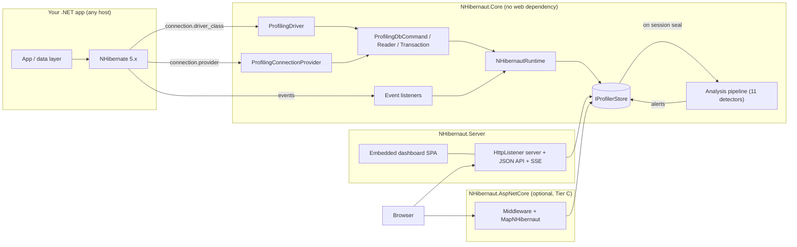
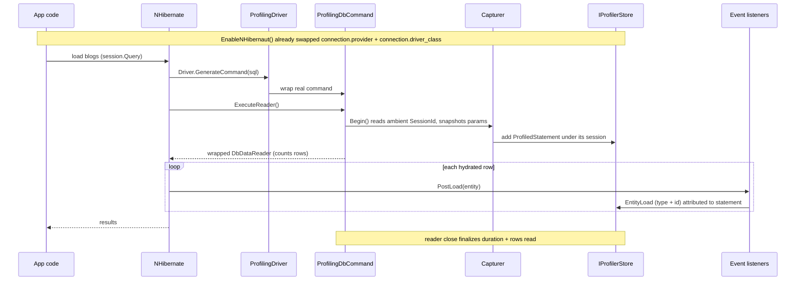
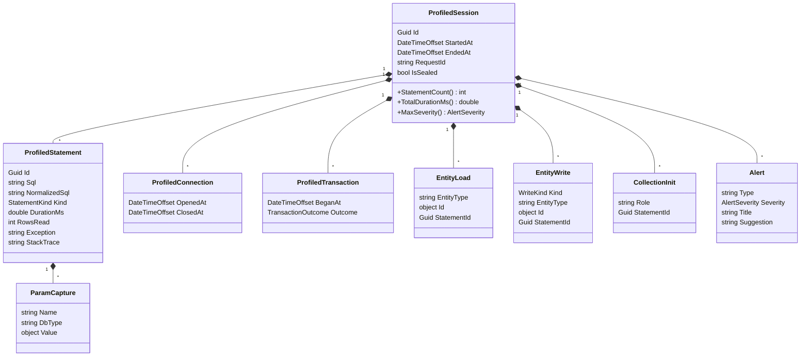
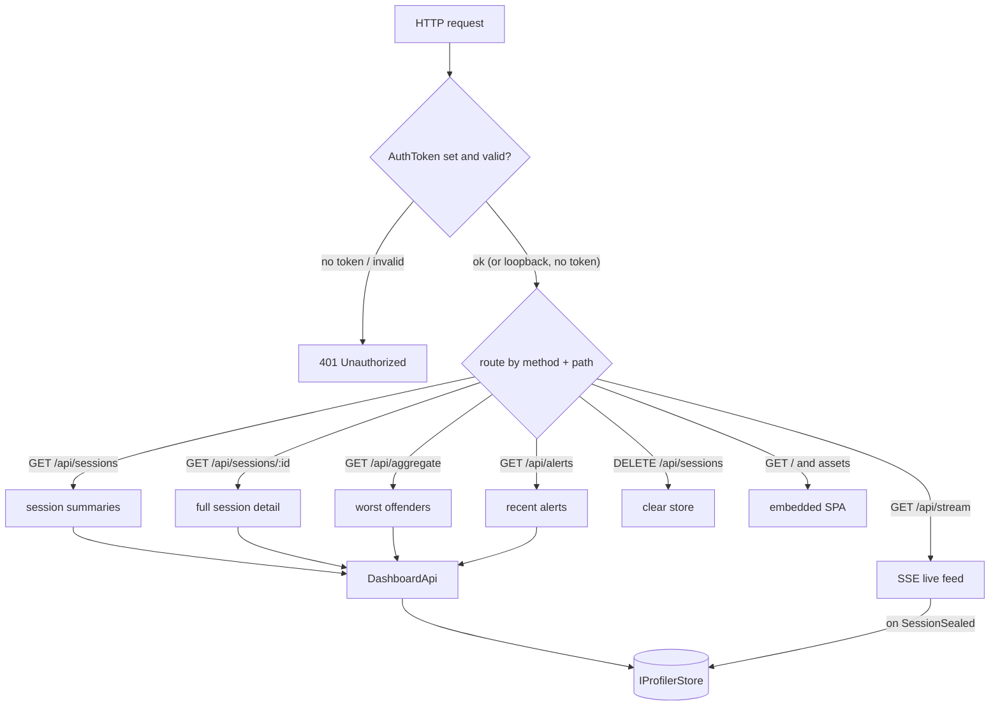
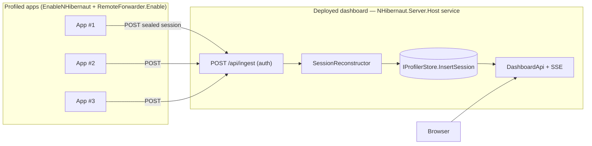
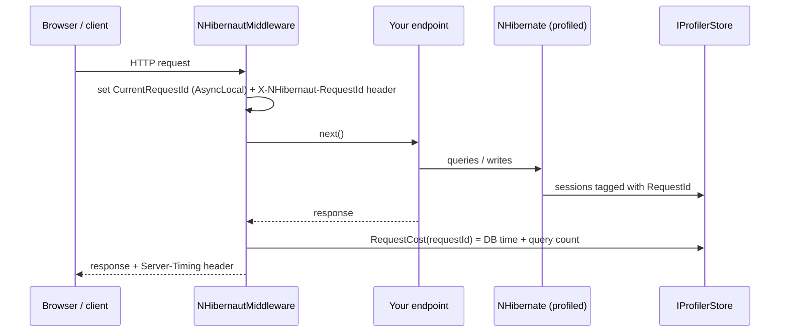

# NHibernaut — Architecture

How NHibernaut hooks into NHibernate, captures activity, analyzes it, and serves the dashboard. For
*using* the dashboard, see the [User Guide](USER_GUIDE.md); for getting started, the
[README](../README.md).

All diagrams are [Mermaid](https://mermaid.js.org/) and render natively on GitHub.

---

## 1. Components

Three packages, layered so that **capture has no web dependency** and the dashboard is optional and
swappable.

| Package | Target | Responsibility |
|---|---|---|
| **NHibernaut.Core** | `net10.0` | Capture (connection/command/driver/listeners), model, store, analysis, runtime, Tier B logging baseline. No web dependency. |
| **NHibernaut.Server** | `net10.0` | Independent `HttpListener` dashboard server + JSON API + SSE + embedded SPA. |
| **NHibernaut.AspNetCore** | `net10.0` | Optional Tier C: request scoping, `Server-Timing` / `X-NHibernaut-RequestId` headers, mount the dashboard on the host pipeline. |

### Integration tiers

| Tier | How | Fidelity |
|---|---|---|
| **A — recommended** | `cfg.EnableNHibernaut()` + `NHibernautServer.Start()` | Full: timing, parameters, rows, object loads, writes, transactions. Works in any host. |
| **B — zero-touch** | Reference Core; a module initializer installs a logging hook | SQL text + session id only (no timing/params/objects). Stands down when Tier A is active. |
| **C — ASP.NET Core** | `AddNHibernaut` / `UseNHibernaut` / `MapNHibernaut` | Tier A capture **plus** per-request correlation, headers, and a mounted dashboard. |

---

## 2. How capture works

`EnableNHibernaut(cfg)` rewrites two NHibernate settings and appends listeners:

1. `connection.provider` → `ProfilingConnectionProvider` (the original provider is stashed under a
   private key and still does the real work).
2. `connection.driver_class` → `ProfilingDriver` (original driver stashed similarly).
3. Appends the object-level event listeners (`PostLoad`, `PostInsert/Update/Delete`, and the
   collection-initialize hook under `ListenerType.LoadCollection`).
4. Marks `NHibernautRuntime.TierAActive = true` and wires the analysis pipeline to the store.

> **Why swap the driver, not just the connection?** NHibernate creates `DbCommand`s through
> `ConnectionProvider.Driver.GenerateCommand(...)`, **not** `connection.CreateCommand()`. Wrapping only
> the connection therefore never sees the SQL (and a raw command rejects a wrapped connection). So the
> **driver** is the real interception point; the connection wrapper handles open/close/transaction
> lifecycle. The wrapped command unwraps the profiling connection/transaction before handing work to
> the real command.

### Correlation (which session / which statement)

- **Statement → session:** NHibernate keeps an ambient `SessionIdLoggingContext.SessionId`
  (an `AsyncLocal<Guid?>`). The command wrapper reads it at execute time — so every statement is
  grouped under the right session without needing the listeners.
- **Statement attribution for objects:** the command wrapper sets an `AsyncLocal<StatementCapture?>
  CurrentStatement` (with save/restore so nested statements don't lose their parent). Listeners attach
  loads/writes/collection-inits to it. Because NHibernate's *two-phase load* fires `PostLoad` **after**
  the reader closes, attribution falls back to the most-recently-run statement when the current one is
  already finalized — accurate because the event fires right after its SELECT.
- **Connection → session:** inferred from the ambient session at acquisition.

> Session-level aggregates are exact; per-statement object attribution and connection→session
> inference are heuristic (ambient/temporal), consistent with comparable tools.

---

## 3. Data model

Everything hangs off `ProfiledSession` (the unit of work = the NHibernate session). It is mutated
under a per-session `SyncRoot` lock while open, then sealed.

### Storage

`IProfilerStore` is the pluggable sink; the default `InMemoryProfilerStore` is a thread-safe,
**bounded ring buffer** keyed by session id, with retention by **count** (default 200) and **age**
(default 30 min) — oldest pruned. Keeping the last N sessions is what makes the *compare* feature
possible with no persistence. The store raises `SessionSealed` to drive analysis and the live feed.

---

## 4. Session lifecycle & sealing

NHibernate 5.x has no session-close hook, so the only observable "session done" signal is the
**connection closing**. The provider records connection open/close and seals the session on close.

```mermaid
stateDiagram-v2
    [*] --> Open: first connection / statement (GetOrCreateSession)
    Open --> Capturing: statements, loads, writes, transactions recorded
    Capturing --> Capturing: more activity (mutated under SyncRoot)
    Capturing --> Sealed: connection closed -> SealSession
    Sealed --> Analyzed: SessionSealed event -> 11 detectors -> Alerts
    Sealed --> Capturing: further activity (re-seals; EndedAt advances)
    Analyzed --> [*]: snapshot read by the dashboard
    Analyzed --> Evicted: retention prunes oldest (count / age)
    Evicted --> [*]
```

With the default `ConnectionReleaseMode.AfterTransaction`, a multi-transaction session re-seals per
transaction; sealing/analysis is therefore **idempotent** (alerts are recomputed each time, the feed
upserts by id). NHibernaut never forces a release mode — that would change host behavior.

---

## 5. Analysis engine

On seal, `AnalysisPipeline` runs all detectors and writes their `Alert`s onto the session. Each
detector implements `IAlertDetector` and is **isolated** in a fail-safe wrapper: one that throws is
swallowed (reported to `NHibernautRuntime.InternalError`) and never blocks the others — proven by a
test. `SqlNormalizer` reduces SQL to a canonical shape (literals/params/whitespace) so N+1 and
duplicate detection can group by shape.

The 11 detectors: `SelectNPlusOne`, `TooManyQueries`, `UnboundedResultSet`, `TooManyRows`,
`TooManyJoins`, `SlowQuery`, `DuplicateQuery`, `CrossThreadSession`, `WriteWithoutTransaction`,
`TooManyWrites`, `SuperfluousUpdate`. Thresholds live on `NHibernautOptions`. See the
[README alert catalogue](../README.md#alert-catalogue).

---

## 6. Dashboard server

`NHibernautServer.Start()` runs an `HttpListener` on a background accept loop; each request is handled
on its own task so the SSE long-poll never blocks accepts. Routing, static assets, and SSE are
hand-rolled over `HttpListenerContext` — no web framework. The SPA ships as **embedded resources**
(no consumer build step).

`DashboardApi` (in NHibernaut.Server) holds the transport-agnostic query logic; both the HttpListener
server and the ASP.NET Core endpoints call it, so the two transports expose an identical API. Wire
DTOs decouple the JSON from the model (no locks on the wire) and render values as display strings.

**Security:** loopback (`127.0.0.1:5005`) by default. A non-loopback bind **refuses to start** without
`Dashboard.AuthToken`; when a token is set it is enforced on every request.

---

## 7. Remote ingestion (centralized dashboard)

The dashboard server can also run **out-of-process**: deploy one instance and have many profiled apps
**forward** their sealed sessions to it over HTTP. This turns NHibernaut into a centralized profiler —
one dashboard, many reporting apps, closer to the commercial NHibernate Profiler's collector model —
while reusing the same store, query API, aggregate, and SSE feed unchanged.

Two pieces, both fail-safe:

- **Sender — `RemoteForwarder`** (in NHibernaut.Server; `RemoteForwarder.Enable(url, token)`): subscribes
  to `IProfilerStore.SessionSealed`, snapshots each sealed session to the wire DTO under its `SyncRoot`
  (`DtoMapper.ToDetail`), and POSTs it to the remote `POST /api/ingest` on a **bounded background
  channel**. If the dashboard is unreachable the queue drops oldest-first — it never blocks or throws
  into capture. Enable it *after* `EnableNHibernaut`, so the analysis pass has already attached the
  session's alerts: they ride the wire and are **not** recomputed remotely.
- **Receiver — `POST /api/ingest`** (on `NHibernautServer`): runs the same `Authorized` check as every
  route (the forwarder sends `X-NHibernaut-Token`), then `SessionReconstructor.FromDetail` rebuilds a
  `ProfiledSession` from the DTO — the inverse of `DtoMapper.ToDetail`, re-parsing Guids/enums and
  carrying parameter values as display strings — and `IProfilerStore.InsertSession` upserts it and
  raises `SessionSealed`. From there the ingested session flows through the unchanged query / aggregate
  / SSE path, so it appears in the list and the live feed exactly like a locally-captured one.

The deployable instance is **`NHibernaut.Server.Host`**, a thin executable that wraps
`NHibernautServer.Start()` in a .NET Generic Host `BackgroundService` (integrating with the Windows
SCM, systemd, and launchd) and reads `NHIBERNAUT_BIND` / `NHIBERNAUT_PORT` / `NHIBERNAUT_AUTH_TOKEN`.
It ships as native installers (`.msi` / `.deb` / `.rpm` / `.pkg`) — see the [Install guide](INSTALL.md).

> Enable forwarding in the apps you profile, **not** on the central host itself: its `InsertSession`
> raises `SessionSealed`, so a forwarder there would re-forward everything it ingests. Forwarding needs
> a reference to NHibernaut.Server, but the app does not host its own dashboard.

---

## 8. Tier B — zero-touch logging baseline

A `[ModuleInitializer]` in Core installs a custom NHibernate logger factory on assembly load. Its
`NHibernate.SQL` logger captures SQL text + session id (no timing/params/objects). It **stands down**
(`IsEnabled(Debug)` returns false) whenever `NHibernautRuntime.TierAActive` is set, so Tier A and Tier
B never double-capture. The install is fail-safe and idempotent.

> Caveat: installing replaces NHibernate's logger factory for the process. By default NHibernate logs
> nothing, so this is transparent; a configured log4net/NLog would be overridden. Tier A is recommended.

---

## 9. Tier C — ASP.NET Core request correlation

The middleware tags each request with an id (`NHibernautRequestContext.CurrentRequestId`, an
`AsyncLocal`), so sessions created during that request get a `RequestId`. On response start it sums the
request's DB cost and emits a `Server-Timing` header; it also emits `X-NHibernaut-RequestId`. No-op in
Production unless `Dashboard.EnabledInProduction`.

---

## 10. Threading & fail-safety

- **Fail-safe is non-negotiable.** Every capture entry point is wrapped (`NHibernautRuntime.SafeExecute`)
  so an internal error is swallowed and routed to `InternalError` — it never throws into, materially
  slows, or alters the host. Tests prove a throwing **detector**, **redactor**, and **store** all stay
  invisible to the host.
- **Thread-safe throughout.** Sessions are mutated under a per-session `SyncRoot`; the store is locked;
  correlation uses `AsyncLocal` so sync and async ADO.NET paths both work. The unit of work is the
  session, not the physical connection.
- **Sampling.** `NHibernautRuntime.IsSampled(sessionId)` (stable per-session from the id hash vs
  `SamplingRate`) gates every capture entry point; non-sampled sessions are never created.

---

## 11. Extension points

- **`IProfilerStore`** — provide a custom sink (file, OTLP, …): `NHibernautRuntime.Store = new MyStore();`.
- **`IAlertDetector`** — add a detector and run a pipeline that includes it:
  `NHibernautRuntime.Analysis = new AnalysisPipeline(AnalysisPipeline.DefaultDetectors().Append(new MyDetector()));`.
  See [CONTRIBUTING](../CONTRIBUTING.md#adding-an-alert-detector).
- **`ParameterRedactor` / `CaptureParameterValues`** — mask or drop parameter values for PII.
- **`EditorLinkScheme`** — change the click-to-source scheme (default `vscode`).
