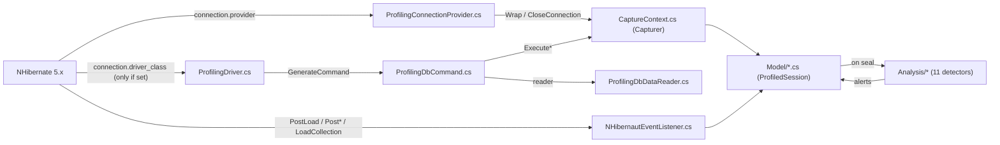

# NHibernaut — Code Map

A navigation map of the codebase: **where to go** to understand or change any part of the system,
without re-reading all the source. Entries are `File.cs › Symbol` plus the non-obvious mechanism that
makes that location load-bearing. For *how it works* see [Architecture](ARCHITECTURE.md); for *config*
see [Configuration](CONFIGURATION.md); for *the wire API* see [API](API.md); for *using* the dashboard
see the [User Guide](USER_GUIDE.md); to get started, the [README](../README.md).

> Line numbers rot — entries are keyed by **file + symbol**. When in doubt, grep the symbol.

---

## 1. Projects

Layered so **capture has no web dependency** and the dashboard is optional/swappable.

| Project | Target | Responsibility |
|---|---|---|
| **NHibernaut.Core** | `net10.0` | Capture (provider/driver/command/reader/transaction/listeners), domain model, in-memory store, 11-detector analysis pipeline, runtime hub + options, Tier B logging baseline. No web dependency. |
| **NHibernaut.Server** | `net10.0` | Self-hosted `HttpListener` dashboard: JSON API + SSE, wire DTOs, transport-agnostic query logic, embedded SPA, remote-ingest forwarder. |
| **NHibernaut.Server.Host** | `net10.0` | Generic-Host service exe (`NHibernautDashboard`): wraps the server in a `BackgroundService`, runs under Windows SCM / systemd, resolves bind/port/token from env vars. |
| **NHibernaut.AspNetCore** | `net10.0` | Optional **Tier C**: per-request correlation, `Server-Timing` / `X-NHibernaut-RequestId` headers, dashboard mounted on the host's own pipeline (same `DashboardApi`). |
| **NHibernaut.Client** | `net10.0` | Reusable client library: `IDashboardClient` abstraction, `HttpDashboardClient` (remote HTTP/SSE), `InProcessDashboardClient` (embedded collector), `DashboardClientFactory`. |
| **NHibernaut.App** | `net10.0` | Avalonia 12 desktop app (Windows / macOS / Linux): MVVM UI, Generic Host DI composition root, rolling file logger, `LiveFeedService`. See [Desktop app](DESKTOP.md). |
| **test/NHibernaut.Tests** | xUnit | Executable spec + regression gate, organized `Mn_*` by milestone (see §6). |
| **samples/** | exe / web | `Sample.Console` = Tier A self-hosted; `Sample.Web` = Tier C mounted. Runnable wiring demos. |

**The capture path, by file** (NHibernate → captured statement):

> **The single most important install gotcha:** the driver swap is **conditional**. `EnableNHibernaut`
> only rewrites `connection.driver_class` when the host *already set it explicitly*. NHibernate builds
> commands via `Driver.GenerateCommand` (not `connection.CreateCommand`), so a host relying on the
> dialect's default driver gets connection/transaction/session capture but **no SQL statements** —
> silently. The "both are required" framing in some docs omits this. See `EnableNHibernaut`.

---

## 2. Subsystems (entry points + non-obvious mechanisms)

### NHibernaut.Core

#### Capture adapters — the ADO.NET / NHibernate decorator layer

Transparently wraps the host's real provider/driver/connection/command/reader/transaction so every SQL
statement (timing, params, rows) and connection/transaction lifecycle is captured under the right
session — **fail-safe** (host behavior never altered).

| Start at | Why |
|---|---|
| `NHibernautConfigurationExtensions.cs › EnableNHibernaut` | Wiring entry: stashes host provider/driver, swaps `connection.provider` (always) + `connection.driver_class` (**only if explicitly set**), appends 5 listeners, sets `TierAActive`, wires store→analysis. |
| `ProfilingDriver.cs › GenerateCommand` | The actual SQL interception point — NHibernate builds commands through the **driver**, so this (not the connection) is what makes command capture fire. |
| `ProfilingDbCommand.cs › ExecuteDbDataReader / ExecuteNonQuery / ExecuteScalar (+async)` | Execute paths call `Capturer.Begin/Complete/Fail`; reader paths return a `ProfilingDbDataReader`. All try/catch, rethrow-unchanged. |
| `CaptureContext.cs › Capturer / StatementCapture` | Central capture orchestration: builds `ProfiledStatement`, reads ambient `SessionId`, snapshots params, manages the `AsyncLocal CurrentStatement` save/restore stack, finalizes duration/rows. |
| `ProfilingConnectionProvider.cs › Wrap / CloseConnection` | Records `OpenedAt` at acquire, `ClosedAt` + `SealSession` at close — **connection close is NHibernate 5.x's only "session done" signal** (no session-close hook). |

Non-obvious:
- **Unwrapping is bidirectional & defensive** — the command unwraps the profiling connection/transaction
  before delegating; the driver unwraps profiling commands before delegating, so the real objects never
  receive a NHibernaut wrapper. Mirror this pattern when wrapping a new member.
- **Sampling gates creation, not just recording** — `Capturer.Begin` returns `null` when not sampled
  (skips the whole statement); a `ProfilingDbConnection` is always returned but sealing a never-created
  session is a no-op.
- **Exactly-once finalization** — `StatementCapture.TryFinalize` (Interlocked) + the reader's own
  `_finalized` guard prevent reader-close vs `Fail` double-stamping duration.
- **Statement→connection is a heuristic** — attributed to the session's most-recent still-open
  connection. Row counts capped at `MaxCapturedRows` (10 000) — **distinct** from the `TooManyRows`
  alert threshold (1 000), so `RowsRead` can under-report above 10k.

#### Capture listeners — object-level capture

One `NHibernautEventListener` registered under 5 listener types; records entity loads/writes/collection
inits and attributes each to the executing statement.

| Start at | Why |
|---|---|
| `NHibernautEventListener.cs › NHibernautEventListener` | Implements `IPostLoad/IPostInsert/Update/Delete/IInitializeCollection` (sync+async). All funnel through `SafeExecute` into `RecordLoad/RecordWrite/RecordCollectionInit`, sharing `ResolveStatement`. |
| `NHibernautEventListener.cs › ResolveStatement` | **Single attribution chokepoint.** Returns the ambient `CurrentStatement` only if its `SessionId == sessionId`; else falls back to the session's last-started statement (`Statements[Count-1]`). |
| `NHibernautConfigurationExtensions.cs › EnableNHibernaut` | Registers the *one shared* instance under `PostLoad/PostInsert/PostUpdate/PostDelete` and the collection hook under **`ListenerType.LoadCollection`** (no `InitializeCollection` enum exists). |

Non-obvious:
- **The fallback condition is "CurrentStatement null OR different session", not "current statement
  finalized"** — there is no finalized flag. They coincide in practice because `Restore()` nulls the
  AsyncLocal when the reader closes, which is exactly when two-phase `PostLoad` fires.
- The async overloads aren't independently async — they call the sync handler and return
  `Task.CompletedTask`. There is no `OnPostLoadAsync` (NHibernate has no async PostLoad interface).
- `EntityName` is a 3-step fallback: persister name → entity type FullName → literal `"?"` (never
  dropped). Unknown collection role coalesces to `""`.
- `IsNoChange` (element-wise compare of `OldState` vs `State`) sets `EntityWrite.NoActualChange` — the
  signal the `SuperfluousUpdate` detector consumes.

#### Model — the in-memory domain model

| Start at | Why |
|---|---|
| `Model/ProfiledSession.cs › ProfiledSession` | **Aggregate root / unit of work.** Holds all per-session collections, `SyncRoot` lock, `IsSealed`, and derived aggregates (`StatementCount`, `TotalDurationMs`, `TotalRowsRead`, `WriteCount`, `MaxSeverity`, `EntityCountsByType`). |
| `Model/ProfiledStatement.cs › ProfiledStatement / ParamCapture` | One executed statement (SQL, NormalizedSql, params, timing, rows, kind, exception, stack trace, per-statement load/init counts). |
| `Model/Captures.cs › ProfiledConnection / ProfiledTransaction / EntityLoad / EntityWrite / CollectionInit` | The captured-record value types hung off a session. |
| `Model/Alert.cs › Alert` · `Model/Enums.cs › StatementKind/WriteKind/TransactionOutcome/AlertSeverity` | Finding + classification enums. |

Non-obvious:
- **`SyncRoot` is not auto-applied** — it's a plain exposed lock object; correctness depends on every
  caller (capture + snapshot code) taking it. Derived aggregates recompute on every access over the
  *live* collections, so reading them off-lock on an open session is a data race.
- **`MaxSeverity` is `AlertSeverity?`** and is `null` (not `Info`) when there are no alerts — callers
  must handle null. `AlertSeverity` is explicitly `Info=0 < Warning=1 < Error=2` so `Max` is meaningful
  — **do not reorder**.
- Session-level lists (`EntityLoads`/`Writes`/`CollectionInits`) are exact; the per-statement counters
  (`EntityLoadCount`/`CollectionInitCount`) are distinct and only bumped when a statement resolves.
- The `EntityWrite` collection is named **`Writes`** in code (not `EntityWrites`). Nullable `int?`
  `RowsRead`/`RowsAffected` mean "not applicable / not measured" — distinct from `0`.

#### Analysis — post-seal anti-pattern detection

11 independent, fail-safe-isolated detectors run over a sealed `ProfiledSession`, writing `Alert`s onto
it; thresholds come from `NHibernautOptions`.

| Start at | Why |
|---|---|
| `Analysis/IAlertDetector.cs › AnalysisPipeline` | Orchestrator. `Analyze()` clears + recomputes alerts under `session.SyncRoot`, each detector inside `SafeExecute`. `DefaultDetectors()` lists the 11 in order. |
| `Analysis/IAlertDetector.cs › IAlertDetector` | Public extension contract: `Detect(ProfiledSession, NHibernautOptions) → IEnumerable<Alert>` (pure, partial-data tolerant). |
| `Analysis/Detectors.cs › AlertFactory + 11 detector classes` | All detector logic + the `AlertFactory.Make` helper (sets every alert's `Type/Severity/Title/Description/Suggestion/RelatedStatementIds`). |
| `Analysis/SqlNormalizer.cs › Normalize` | Regex canonicalizer (literals/params/numbers → `?`, whitespace collapsed); computed once at capture and stored on `ProfiledStatement.NormalizedSql`. |

Non-obvious / corrected facts:
- **Per-detector isolation is *inside* the loop** — each `Detect` runs in `SafeExecute`, with `.ToList()`
  forcing the lazy `yield` body to execute *inside* the try; a throwing detector returns empty and the
  loop continues. Idempotent via `Alerts.Clear()` then recompute under lock.
- **The N+1 collection-init path is a *gated fallback*, not a symmetric OR.** `SelectNPlusOneDetector`
  groups SELECTs by `NormalizedSql`; if *any* shape alert fired it returns early and **never** evaluates
  the collection-init-by-role fallback. A session won't show both kinds at once.
- **`DuplicateQuery` groups by RAW `Sql` + params, NOT `NormalizedSql`.** The normalizer feeds N+1 and
  the Server aggregate/worst-offenders grouping only — *not* duplicate detection (some docs over-claim
  this). DuplicateQuery deliberately catches byte-identical re-executions.
- N+1 fires on `>= N` (inclusive); every other threshold detector is strict `>`. `TooManyRows`/
  `TooManyJoins` scan **all** statement kinds; `UnboundedResultSet` is SELECT-only and suppresses on a
  naive substring scan for `limit`/`top`/`fetch`/`rownum`.
- `WriteWithoutTransaction` treats an open (un-completed) transaction as `CompletedAt ?? MaxValue` —
  covering everything after `BeganAt`.

#### Runtime, options & config

| Start at | Why |
|---|---|
| `NHibernautOptions.cs › NHibernautOptions` | **Config source-of-record:** all alert thresholds, capture/redaction, retention, sampling, nested `Dashboard`. Mutated via `EnableNHibernaut(o => …)`, read from `NHibernautRuntime.Options`. |
| `NHibernautOptions.cs › DashboardOptions / ParamContext` | Dashboard settings (bind/port/auth/production/editor-link/authorize); `ParamContext` = the input to a `ParameterRedactor`. |
| `NHibernautRuntime.cs › NHibernautRuntime` | **Static hub:** holds `Options/Store/Analysis/TierAActive`, the `InternalError` channel, `IsSampled`, and the `SafeExecute` wrappers all capture routes through. |
| `NHibernautRequestContext.cs › CurrentRequestId` | `AsyncLocal<string?>` request id (Tier C), stamped onto sessions at creation. |

Non-obvious:
- **`CaptureStackTraces` default is environment-dependent**, evaluated at construction via
  `IsDevelopmentEnvironment()` (`ASPNETCORE_ENVIRONMENT`/`DOTNET_ENVIRONMENT == "Development"`). A
  non-Development process has click-to-source **off** unless explicitly enabled.
- `IsSampled(Guid)` is deterministic per session id (`>=1.0`→true fast path, `<=0.0`→false, else hash
  bucket). All capture points agree for a session's lifetime; non-sampled sessions are never created.
- **`SafeExecute` is `internal`** — external code can't call it. The *public* fail-safe surface is
  `ReportInternalError` + the `InternalError` event. Likewise `Options/Store/Analysis/TierAActive` have
  **internal setters** — the `NHibernautRuntime.Store = new MyStore()` extension snippet only compiles
  inside Core or via the configure lambda.

#### Storage — the in-memory store

| Start at | Why |
|---|---|
| `Storage/IProfilerStore.cs › IProfilerStore` | Store contract. `InsertSession` is a **default interface method that throws `NotSupportedException`** (only central-dashboard stores override it); raises `SessionSealed`. |
| `Storage/InMemoryProfilerStore.cs › InMemoryProfilerStore` | Default store. Bounded eviction-ordered buffer: `Dictionary _byId` + `LinkedList _order` (front oldest), pruned on insert by **count (200)** and **age (30 min)**. All members lock `_gate`; `SessionSealed` raised *outside* the lock to avoid subscriber deadlock. |
| `NHibernautRuntime.cs › Store` | Static wiring (defaults to `InMemoryProfilerStore`; replaced by `EnableNHibernaut` with an options-bound instance). |

- `SealSession` advances `EndedAt` and **re-raises `SessionSealed` each call** — re-seal (per-transaction
  under default `ConnectionReleaseMode.AfterTransaction`) re-runs analysis idempotently. No code ever
  forces a release mode.

#### Logging baseline (Tier B, zero-touch)

| Start at | Why |
|---|---|
| `Logging/LoggingBaseline.cs › Install ([ModuleInitializer])` | Runs once on assembly load; idempotently (`Interlocked`) swaps NHibernate's logger factory inside a fail-safe try/catch. |
| `Logging/NHibernautLoggerFactory.cs › LoggerFor / SqlCapturingLogger / NoOpLogger` | Routes only `NHibernate.SQL` to the capturing logger; everything else → no-op. Capture is gated by `TierAActive` (stands down for Tier A) + sampling. |

Non-obvious:
- **Install *timing* is the real correctness constraint, not "on assembly load".** NHibernate caches the
  `NHibernate.SQL` logger in a static field on the **first SessionFactory build**. If a SessionFactory
  is built before Core's initializer runs, the disabled logger is cached for the process lifetime and
  Tier B silently captures **nothing**. Fix: force Core to load early (call `EnableNHibernaut` /
  `NHibernautServer.Start`). See `test/.../TestModuleInit.cs` for the canonical workaround.
- Stand-down survives caching because `TierAActive` is re-read live on **every** `IsEnabled`/`Log` call.
- Captured fields are richer than "SQL + session id": also `NormalizedSql`, `StartedAt`, `Kind` (but no
  duration/params/rows/objects). Tier B is also subject to `SamplingRate`.

### NHibernaut.Server

#### Server, DTOs, ingest, forwarder, assets

| Start at | Why |
|---|---|
| `NHibernautServer.cs › Route` | **HTTP router** (HttpListener): method+path → handler, `Authorized()` first on every request. `Start/Stop` static, idempotent, singleton-guarded. Routes: `/api/config`, `/api/sessions(/{id})`, `/api/aggregate`, `/api/alerts`, `/api/stream` (SSE), `POST /api/ingest`, `DELETE /api/sessions`, assets. |
| `DashboardApi.cs › DashboardApi` | **Transport-agnostic query logic** over the store. Called by **both** the HttpListener server and the Tier C endpoints — do not duplicate logic in handlers. |
| `Dtos.cs › DtoMapper / *Dto` | Wire DTO records + `ProfiledSession → DTO` mapping (`ToSummary/ToDetail/ToStatement/ToAlert/ToAggregate`), all snapshotting under `s.SyncRoot`. (`AlertFeedItemDto` lives in `NHibernautServer.cs`, not here.) |
| `SessionReconstructor.cs › FromDetail` | Inverse of `ToDetail` for the ingest endpoint; re-parses Guids/enums, forces `IsSealed=true`. |
| `RemoteForwarder.cs › RemoteForwarder` | Subscribes `Store.SessionSealed`, snapshots via `ToDetail`, POSTs to remote `/api/ingest` over a bounded background channel. |
| `Assets.cs › TryGet / Serve` | Serves the embedded SPA from manifest resources by suffix-match (`.wwwroot.<dotted-path>`); `/` → `index.html`. |

Non-obvious / corrected facts:
- **Auth model:** no `AuthToken` ⇒ all requests authorized (loopback dev). If set, `X-NHibernaut-Token`
  header (**precedence**) or `?token=` query, ordinal compare, on **every** route incl. SSE/assets.
  `StartInternal` **refuses to start** (throws) on a non-loopback bind without a token. Loopback binds
  the literal `127.0.0.1` (not `localhost`, which would DNS-resolve and hang under systemd DynamicUser).
- **`RemoteForwarder` uses `BoundedChannelFullMode.DropWrite`** — it drops the **newest/incoming** write
  when the 1024-deep channel is full, **not oldest-first**. No retry on non-2xx. Enable it in *profiled*
  apps, never on the central host (its `InsertSession` raises `SessionSealed` → would re-forward).
- **Round-trip drops three model-only fields:** individual `ThreadIds` aren't on the wire (`FromDetail`
  synthesizes `0..ThreadCount-1`), `IsSealed` is forced `true`, and `RequestId` has no DTO field so it
  is dropped. `EntityCountsByType` is **not** lost — it is a *derived* property (`EntityLoads` grouped by
  type), so it recomputes correctly once the loads are restored.
- `DashboardApi.Sessions` over-fetches `Math.Max(take,1000)` then filters (`since`, `minSeverity` floor)
  then `Take(take)`. `Aggregate`/`Alerts` scan **all** sessions (`int.MaxValue`). No SPA deep-link
  fallback — unknown asset paths 404 (not `index.html`).
- JSON = `JsonSerializerDefaults.Web` (camelCase) via `NHibernautServer.JsonOptions`, shared by both
  transports + the forwarder.

### NHibernaut.Server.Host

| Start at | Why |
|---|---|
| `Program.cs › top-level statements` | Composition root: Generic Host (content root pinned to `AppContext.BaseDirectory`), `AddWindowsService` (name `NHibernautDashboard`) + `AddSystemd`, resolves options, `Build().Run()`. |
| `DashboardHostOptions.cs › Resolve / GenerateToken / IsLoopback` | Reads `NHIBERNAUT_BIND` (default `0.0.0.0`) / `NHIBERNAUT_PORT` (5005) / `NHIBERNAUT_AUTH_TOKEN`; validates port; **auto-generates a 64-char hex token for any non-loopback bind without one**. |
| `DashboardHostedService.cs › DashboardHostedService` | `BackgroundService` lifecycle: copies options onto `Runtime.Options.Dashboard`, `NHibernautServer.Start` in `ExecuteAsync`, logs URL (+ generated token at Warning), `Stop` in `StopAsync`. |

Non-obvious:
- **Two different bind defaults by entry point, both correct:** Host/service = `0.0.0.0` (reachable, with
  auto-token); Core/library = `127.0.0.1`. Don't reconcile.
- Token auto-generation **pre-empts** the server's non-loopback refusal — that guard is effectively dead
  code in the deployed-service path; it only protects in-process library callers.
- **`ContentRootPath = AppContext.BaseDirectory` is an operational invariant**, not cosmetic: service
  managers launch from a foreign cwd (`/`), and the appsettings file watcher rooted at `/` would
  recursively watch the whole filesystem and trip systemd's 90s start timeout. Hex token (not Base64) so
  it survives `?token=` URL login. No real **launchd** integration exists — macOS uses the Generic Host's
  default SIGTERM/console lifetime.

### NHibernaut.AspNetCore (Tier C)

| Start at | Why |
|---|---|
| `NHibernautServiceCollectionExtensions.cs › AddNHibernaut` | DI registration: builds options, sets `Runtime.Options`, registers singleton. **Does NOT enable capture** (that's `cfg.EnableNHibernaut` in Core). |
| `NHibernautApplicationBuilderExtensions.cs › UseNHibernaut / MapNHibernaut` | `UseNHibernaut` inserts the middleware; `MapNHibernaut` branches the pipeline at a path (default `/nhibernaut`, configurable) and runs `DashboardEndpoints.HandleAsync`. |
| `NHibernautMiddleware.cs › Invoke` | Sets `CurrentRequestId`, emits `X-NHibernaut-RequestId` immediately and `Server-Timing` via `Response.OnStarting`; **no-op in Production** unless `Dashboard.EnabledInProduction`. |
| `NHibernautHostingStartup.cs › NHibernautHostingStartup` | Zero-code auto-wire via `[assembly:HostingStartup]` when `NHIBERNAUT_ENABLED` is truthy (`1` or `true`). |
| `DashboardEndpoints.cs › HandleAsync` | Tier C mirror of the route table over ASP.NET Core, delegating to the shared `DashboardApi` — keep in lockstep with `NHibernautServer.Route`. |

Non-obvious / corrected facts:
- **Footgun: `AddNHibernaut` after `EnableNHibernaut` discards the Options.** `AddNHibernaut`
  unconditionally does `Runtime.Options = new NHibernautOptions()`, throwing away thresholds/redactor/
  `CaptureStackTraces` that `EnableNHibernaut` just set. Pass config to `AddNHibernaut`, or call it
  **first**. The shipped web sample has this latent bug (benign only because the stack-trace default is
  already `true` in Development).
- `Server-Timing` is computed in `Response.OnStarting` (not inline) because NHibernate work + session
  sealing must finish first; by then the AsyncLocal is cleared, so the callback closes over the captured
  request-id string and `DashboardApi.RequestCost` looks sessions up by `RequestId` (O(store) per
  response).
- **Tier C auth has no loopback concept** — unlike the HttpListener server, the mount inherits the host's
  binding and only enforces a token when `AuthToken` is set. With no token the dashboard (SQL + params)
  is reachable on every host binding (subject only to Production gating).
- **`DashboardOptions.Authorize` is declared but never invoked** anywhere — `Authorized` only checks
  `AuthToken`. Treat as un-wired.

### NHibernaut.Client + NHibernaut.App (desktop)

See the [Desktop app guide](DESKTOP.md) for install instructions, modes, and log paths.

#### NHibernaut.Client — client library

Transport-agnostic async gateway to profiling data. No UI dependency; usable independently.

| Start at | Why |
|---|---|
| `IDashboardClient.cs › IDashboardClient` | **Strategy contract.** `IAsyncDisposable` gateway: config, sessions, session detail, aggregate, alerts, clear, and `StreamSessionsAsync` (live feed). |
| `DashboardConnection.cs › DashboardConnection` | Value record describing a connection: `Mode` (`Remote`\|`Embedded`), `Url`, `Token`, `BindAddress`, `Port`. Factory methods `Remote(url, token?)` and `Embedded(bind, port, token?)`. |
| `HttpDashboardClient.cs › HttpDashboardClient` | **Remote impl.** Calls `NHibernautServer`'s JSON API + SSE over `HttpClient`. Sends `X-NHibernaut-Token` when a token is present. `StreamSessionsAsync` reads SSE via `SseReader`, filtering for the named `session` event. |
| `InProcessDashboardClient.cs › InProcessDashboardClient` | **Embedded impl.** Starts `NHibernautServer` in-process and reads the store directly via `DashboardApi` — no HTTP round-trip to itself. Bridges `IProfilerStore.SessionSealed` onto a bounded channel (`BoundedChannelFullMode.DropOldest`, capacity 1024) for `StreamSessionsAsync`. `DisposeAsync` stops the server. |
| `DashboardClientFactory.cs › DashboardClientFactory` | **Factory.** `CreateAsync(DashboardConnection)` → `InProcessDashboardClient` (started) or `HttpDashboardClient`; injects a named `HttpClient` from `IHttpClientFactory` for the remote path. |

Non-obvious:
- **`InProcessDashboardClient` owns the server lifecycle** — it calls `NHibernautServer.Stop()` in
  `DisposeAsync`. Disposing before swapping connection leaves the port free for the next start.
- **Non-loopback embedded bind requires a token** — `NHibernautServer.Start` refuses a non-loopback
  address without `AuthToken`; the factory propagates `DashboardConnection.Token` into the options.
- `HttpDashboardClient` accepts an externally-supplied `HttpClient` and disposes it only when
  it created it itself (`_ownsHttp`), so `IHttpClientFactory`-managed clients survive the client.

#### NHibernaut.App — Avalonia desktop app

| Start at | Why |
|---|---|
| `Program.cs › Main` | Entry point. Builds the Generic Host (`HostBuilderFactory.Build`), wires top-level exception handlers into the file logger, then launches Avalonia (`StartWithClassicDesktopLifetime`). `--verbose` raises the file log level to `Debug`. |
| `Composition/HostBuilderFactory.cs › Build` | **DI composition root.** Registers logging (console + debug + rolling file), named `HttpClient`, `DashboardClientFactory`, `LiveFeedService`, `EditorSchemeProvider`, `EditorLinkService`, `ISettingsService`, all ViewModels. |
| `Client/IDashboardClient.cs` + `DashboardClientFactory.cs` | Client wiring — see NHibernaut.Client table above. |
| `Services/LiveFeedService.cs › LiveFeedService` | **Observer.** Pumps `IDashboardClient.StreamSessionsAsync` on a background `Task`; marshals each `SessionSummaryDto` onto the Avalonia UI thread via `IUiDispatcher`. `Start`/`Stop`/`DisposeAsync` manage the cancellation token. |
| `ViewModels/MainWindowViewModel.cs` | Root VM: owns the active `IDashboardClient`, drives the connection flow, triggers `LiveFeedService.Start`. |
| `ViewModels/SessionsViewModel.cs` | Session list, receives live feed notifications. |
| `ViewModels/SessionDetailViewModel.cs` | Full session detail (transient, factory-resolved). |
| `ViewModels/AggregateViewModel.cs` | Worst-offenders / aggregate. |
| `ViewModels/CompareViewModel.cs` | Side-by-side session compare. |
| `ViewModels/ConnectionViewModel.cs` | Connection mode / URL / token input. |
| `Logging/AppPaths.cs › AppPaths` | Per-OS log and settings paths (Windows `%LOCALAPPDATA%`/`%APPDATA%`, macOS `~/Library/Logs`/`~/Library/Application Support`, Linux XDG). |
| `Logging/FileLoggerProvider.cs` | Rolling file logger: `nhibernaut-<yyyyMMdd>.log`, rolls at 10 MB, keeps 7 files, one writer thread draining a `BlockingCollection`. |
| `Logging/AvaloniaLogSink.cs` | Bridges `Avalonia.Logging.Logger` into `ILogger` (wired in `App.OnFrameworkInitializationCompleted`), so Avalonia internal events reach the file log. |

Non-obvious:
- **`--verbose` is read before the host builds** — `Program.Main` checks `args.Contains("--verbose")`
  and passes `LogLevel.Debug` or `LogLevel.Information` to `HostBuilderFactory.Build`.
- **ViewModels are singleton except `SessionDetailViewModel`** — it is transient and resolved via
  `Func<SessionDetailViewModel>` to create one per selected session.
- **`ISettingsService` persists the last-used `DashboardConnection`** to `AppPaths.SettingsFile`
  so the connection screen reopens pre-filled.

---

### Frontend SPA (read-only dashboard)

A single ~384-line vanilla-JS IIFE + one CSS + one HTML, embedded as resources (no build step).

| Start at | Why |
|---|---|
| `wwwroot/app.js › boot() / route()` | Whole SPA in one closure. `boot()` fetches `/api/config`, `loadSessions()`, `connectLive()`, `route()`. Hash router: `#/sessions[/{guid}]`, `#/aggregate`, `#/compare`. |
| `wwwroot/app.js › api() / base / token` | `base` derived from `document.currentScript.src` so the same SPA works at `/` **and** under the Tier C mount; `?token=` propagated to every fetch **and** the EventSource URL. |
| `wwwroot/app.js › connectLive()` | SSE consumer; listens for the named event **`session`** (must match the server's `event: session` frame), upserts summary by id. |
| `wwwroot/index.html` · `wwwroot/app.css` | Static shell (counters, nav tabs, Live/Clear) · VS Code-dark theme + waterfall/alert styling. |

Non-obvious:
- **The `N+1` top-bar counter is mislabeled** — `app.js` counts sessions with *any* alert of *any*
  severity (truthy `maxSeverity`), not N+1 incidents.
- **Slow-query red is hardcoded `>200ms`**, decoupled from `options.SlowQueryMs` — lower the threshold
  and 100–200ms statements alert but never turn red.
- The SPA hard-depends on **`GET /api/config`** at boot (for `editorLinkScheme`) but never calls the
  documented `/api/alerts`. Live-feed pause is **lossy** (events dropped while paused, no backfill on
  resume). All data passes through `esc()` before `innerHTML` (read-only, local).

---

## 3. "How do I…?" — task → location

| Task | Go to |
|---|---|
| Change **what** is captured per statement (params, rows, stack, kind, normalized SQL) | `CaptureContext.cs › Capturer.Begin` + `SnapshotParameters` |
| Change **how/when** adapters install (provider/driver swap, listeners, store wiring) | `NHibernautConfigurationExtensions.cs › EnableNHibernaut` |
| Make SQL capture fire when host has **no explicit `connection.driver_class`** | Resolve the dialect default driver inside `EnableNHibernaut` (the `M2` comment marks the spot) |
| Change command/SQL **interception** | `ProfilingDriver.cs › GenerateCommand` + `ProfilingDbCommand.cs` (mirror the unwrap pattern for new members) |
| Change session **sealing / lifecycle** | `ProfilingConnectionProvider.cs › CloseConnection` + `InMemoryProfilerStore.cs › SealSession` |
| Change row-count behavior / the 10k cap | `ProfilingDbDataReader.cs › CountRow` + `NHibernautOptions.cs › MaxCapturedRows` |
| Change **object→statement attribution** | `NHibernautEventListener.cs › ResolveStatement` (the attribution *window* lives in `CaptureContext.cs › Begin/Restore`) |
| Change **superfluous-update** detection | `NHibernautEventListener.cs › IsNoChange` → `EntityWrite.NoActualChange` |
| **Add an alert detector** | implement `IAlertDetector` in `Analysis/Detectors.cs`, add to `IAlertDetector.cs › AnalysisPipeline.DefaultDetectors()` (or compose `DefaultDetectors().Append(new X())`); add a fires/does-not-fire pair to `M5_DetectorTests` |
| **Change a default threshold** (or add one) | `NHibernautOptions.cs`; read via the `options` arg in the detector; assert the default in `M1_OptionsTests.Defaults_match_spec` |
| Change **N+1 / duplicate grouping** | `Detectors.cs › SelectNPlusOneDetector` + `SqlNormalizer.cs` (shape) vs `Detectors.cs › DuplicateQueryDetector.Signature` (raw exact-match — different key) |
| Change the **shape of every alert** | `Detectors.cs › AlertFactory.Make` |
| **Customize storage** | implement `IProfilerStore` (override `InsertSession` if you accept ingest); assign `NHibernautRuntime.Store` (Core/configure-path only) |
| Change **retention** (count/age) | `NHibernautOptions.cs › RetentionSessionCount / RetentionMaxAge` (read by `InMemoryProfilerStore.Prune`) |
| Change **sampling / redaction** | `NHibernautOptions.cs › SamplingRate / CaptureParameterValues / ParameterRedactor`; gate is `NHibernautRuntime.cs › IsSampled` |
| **Add / change an HTTP API route** | `NHibernautServer.cs › Route` **and** mirror in `DashboardEndpoints.cs › HandleAsync`; shared logic in `DashboardApi.cs` |
| **Change a wire DTO shape** | `Dtos.cs` record + **both** `DtoMapper.ToDetail` (forward) and `SessionReconstructor.cs › FromDetail` (inverse) |
| Change **auth** behavior | `NHibernautServer.cs › Authorized` + `DashboardEndpoints.cs › Authorized` (keep in sync) |
| Change forwarder **backpressure/drop policy** | `RemoteForwarder.cs` ctor `BoundedChannelOptions` (1024, `DropWrite`) |
| Change **SPA assets / content types** | `Assets.cs` (ContentTypes map + suffix match); bundling = `NHibernaut.Server.csproj` `<EmbeddedResource>` |
| Change **request-id / headers** (Tier C) | `NHibernautMiddleware.cs` (Guid `N` format, `X-NHibernaut-RequestId`, `Server-Timing` string) |
| Change **per-request DB cost** summing | `DashboardApi.cs › RequestCost` (shared — affects both transports) |
| Change **service config / env vars** | `DashboardHostOptions.cs › Resolve` (defaults + validation here, not `Program.cs`) |
| Change **Windows service name** | `Program.cs › AddWindowsService` (keep in sync with `docs/INSTALL.md`) |
| Change **Tier B capture fields / stand-down** | `NHibernautLoggerFactory.cs › SqlCapturingLogger.Log` / the `TierAActive` checks |
| Restyle / re-route the **SPA** | `wwwroot/app.css` (`:root` tokens, `.sev-*`) · `wwwroot/app.js › route()` + `index.html` tabs |
| Add a config option to `/api/config` | `DashboardOptions` in `NHibernautOptions.cs` → returned by `GET /api/config`; SPA reads at boot |

---

## 4. Fail-safety & sampling (cross-cutting)

Every capture entry point runs inside `NHibernautRuntime.SafeExecute` (swallows → `InternalError`
event); execute paths **rethrow the host's exception unchanged** after `Capturer.Fail`. A throwing
detector, redactor, or store **never** surfaces to the host. `IsSampled(sessionId)` (stable per id)
gates *creation* at every entry — `CaptureContext`, `ProfilingConnectionProvider`, `ProfilingDbTransaction`,
`NHibernautEventListener`, and the Tier B `SqlCapturingLogger`. To audit it, start at
`NHibernautRuntime.cs › IsSampled` and follow callers.

---

## 5. Runtime global state (testing caveat)

`NHibernautRuntime.Options / Store / Analysis / TierAActive` are **process-global mutable** statics with
internal setters. Tests run **sequentially** (`AssemblyInfo.cs › [assembly: CollectionBehavior(
DisableTestParallelization = true)]`); any test mutating them must save/restore (see `M8` try/finally,
`M10.Dispose`). A leaked `SamplingRate=0.0` was the cause of a past order-dependent flaky test. Tests
reach internal setters / `DtoMapper.ToDetail` via `InternalsVisibleTo` on Core + Server.

---

## 6. Milestone test map

`test/NHibernaut.Tests` is the executable spec; files are prefixed `Mn_` by build milestone. The shared
fixture is `Infrastructure/SqliteTestDatabase.cs › BuildProfiledSessionFactory` (unique shared-cache
in-memory SQLite, one keep-alive connection, DDL run off-profiler so captured counts stay deterministic).

| File | Proves |
|---|---|
| `M0a_EnvironmentSmokeTests` | A real NHibernate SessionFactory round-trips against SQLite (rules out env failures). |
| `M0b_WalkingSkeletonTests` | `EnableNHibernaut` swaps the provider **and** capture fires — one query → one statement, grouped by SessionId. |
| `M1_ScaffoldingTests` | `NHibernautOptions` defaults (all 7 thresholds + capture), `ProfiledSession` aggregates, `InMemoryProfilerStore` retention (count/age eviction, seal, clear). |
| `M2_StatementCaptureTests` | Full flat SQL capture: timing/params/rows/kind/exception/transactions, sync + async. |
| `M3_EventListenerTests` | Listeners + correlation: entity loads by type, collection-inits by role, writes by kind with PK, attributed to a statement. |
| `M4_GroupingSealingTests` | Connection open/close grouping, aggregates, session sealing on close + `SessionSealed`. |
| `M5_AnalysisIntegrationTests` | Detectors fire on **real** activity (N+1, UnboundedResultSet, WriteWithoutTransaction, CrossThreadSession). |
| `M5_AnalysisUnitTests` | `SqlNormalizer` + every detector above/below threshold + pipeline swallows a throwing detector. |
| `M5b_FailSafeIntegrationTests` | A throwing `ParameterRedactor` / `IProfilerStore` never breaks the host query. |
| `M6_ServerTests` | HttpListener JSON/SSE endpoints + non-loopback-needs-token refusal + token enforcement. |
| `M7_DashboardTests` | Embedded SPA served (HTML/app.js/app.css) + stack-trace capture for click-to-source. |
| `M8_LoggingBaselineTests` | Tier B captures SQL without `EnableNHibernaut`, and stands down when `TierAActive`. |
| `M9_AspNetCoreTests` | Tier C: request scoping, `Server-Timing` + `X-NHibernaut-RequestId`, mounted dashboard, ingest, hidden-in-Production. |
| `M10_SamplingRedactionTests` | Sampling (0.0 captures nothing / 1.0 captures) + parameter redaction / `CaptureParameterValues`. |
| `M11_IngestTests` | Wire DTO round-trip (`ToDetail`/`FromDetail`), `POST /api/ingest`, `InsertSession` default-throws for legacy stores, `RemoteForwarder` forwards sealed sessions. |

> `Infrastructure/MicrosoftDataSqliteDriver.cs` is a custom NHibernate driver the suite (and both
> samples) ship because NHibernate 5.x has no built-in Microsoft.Data.Sqlite driver.

---

## 7. Samples (end-user wiring)

| Sample | Wiring |
|---|---|
| `samples/NHibernaut.Sample.Console/Program.cs` | **Tier A self-hosted:** `cfg.EnableNHibernaut(o => o.CaptureStackTraces = true)` before `BuildSessionFactory`, then `NHibernautServer.Start(...)` on its own HttpListener. `Workload` generates N+1 / writes / no-tx writes / unbounded SELECT. |
| `samples/NHibernaut.Sample.Web/Program.cs` | **Tier C mounted:** `EnableNHibernaut` + `AddNHibernaut` + `UseNHibernaut` + `MapNHibernaut` (dashboard at `/nhibernaut`, headers). `/blogs` deliberately triggers N+1. ⚠️ exhibits the `AddNHibernaut`-after-`EnableNHibernaut` footgun (§2 Tier C). |
