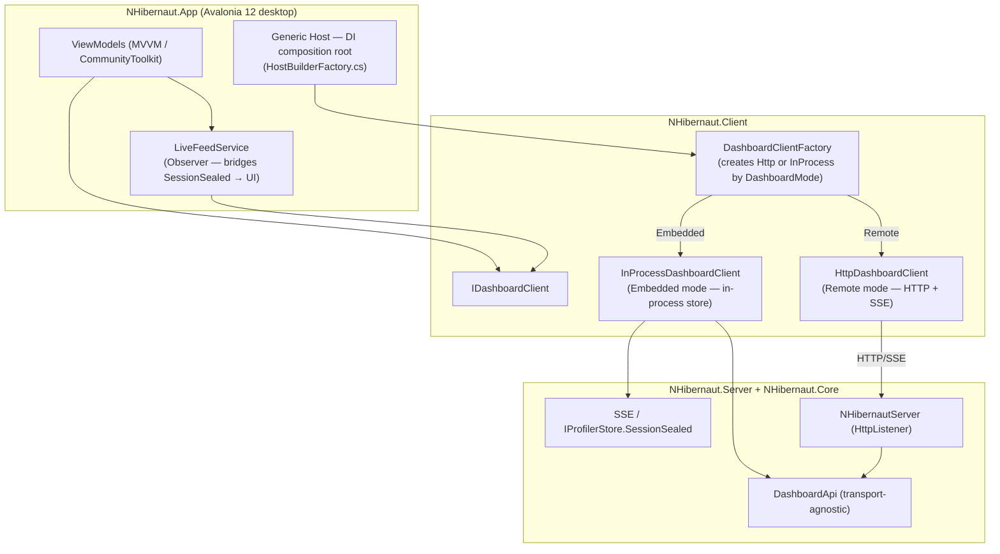

# NHibernaut — Desktop App

A native cross-platform desktop UI for NHibernaut profiling data — Windows, macOS (Apple Silicon),
and Linux — built with Avalonia 12. It consumes the same sessions, alerts, aggregate, and live feed
as the web dashboard by talking to `NHibernaut.Server` through a reusable client library
(`NHibernaut.Client`), with zero changes to the shared core libraries. See the
[README](../README.md) for the library quickstart and the [Architecture](ARCHITECTURE.md) for how
capture and the dashboard server work.

---

## Modes

The desktop app supports two connection modes, selected from its connection screen.

### Remote — connect to a running dashboard

`DashboardMode.Remote` (default). The app connects over HTTP/SSE to any running `NHibernautServer`:

| Target | Default URL | Notes |
|---|---|---|
| Your dev app (in-process `NHibernautServer`) | `http://127.0.0.1:5005` | Start with `NHibernautServer.Start()` in your app. |
| Deployed `NHibernaut.Server.Host` service | configured bind/port | Requires `NHIBERNAUT_AUTH_TOKEN` when bound beyond loopback; see [Install guide](INSTALL.md). |

Pass an optional auth token (`X-NHibernaut-Token`) when the target server requires one. The default
URL is `http://127.0.0.1:5005`; change it in the connection screen. Saving a connection that carries a
token **persists it in clear text** in `settings.json` — see [Token storage](#token-storage).

### Embedded collector — host the dashboard in-process

`DashboardMode.Embedded`. The desktop app starts its own in-process `NHibernautServer` (on a chosen
bind address and port) and acts as the collector — profiled apps forward their sealed sessions to it.

**Recipe:** in each profiled app, after enabling capture:

```csharp
cfg.EnableNHibernaut();                                                  // capture (Tier A)
NHibernaut.Server.RemoteForwarder.Enable("http://<desktop-host>:<port>", "<token-if-any>");
```

Each sealed session is POSTed to the desktop's `POST /api/ingest` (asynchronous, bounded,
fail-safe). Sessions stream into the desktop app in real time.

> **Default bind is `127.0.0.1`** — the embedded collector only accepts forwarded sessions from the
> same machine. To receive from other hosts, configure a non-loopback bind address **and** set an
> auth token (the server refuses to start on a non-loopback bind without one).

> **Windows: non-loopback bind needs a one-time URL reservation.** A non-loopback bind registers
> `http://+:<port>/`, which HTTP.sys rejects with *Access is denied* unless the URL is reserved or
> the app runs elevated. Reserve it once (elevated):
> `netsh http add urlacl url=http://+:<port>/ user=Everyone`. Loopback (`127.0.0.1`, the default)
> needs no setup.

The web dashboard is also reachable at that bind/port while the embedded collector is running.

The embedded collector can also serve `nhibernaut-mcp` for AI-assisted profiling. Point the MCP server
at the same bind and port:

```bash
nhibernaut-mcp --url http://<desktop-host>:<port> --token <dashboard-token>
```

Loopback embedded collectors normally do not require auth, so the `--token` argument can be omitted.
For full MCP setup, tools, resources, prompts, and sensitive-output behavior, see the
[MCP guide](MCP.md).

---

## Install

Artifacts are attached to each [GitHub Release](https://github.com/cstaerkel/NHibernaut/releases).
**macOS: Apple Silicon (arm64) only.**

> **Unsigned artifacts.** The desktop installers and bundles are not code-signed or notarized.
> See the platform-specific notes below and compare with the [Install guide](INSTALL.md) for the
> dashboard service, which carries the same caveat.

### Windows

| Artifact | Format | Install |
|---|---|---|
| `nhibernaut-app-<version>-win-x64.zip` | Portable | Unzip anywhere, run `nhibernaut-app.exe`. |
| `nhibernaut-app-<version>-win-x64.msi` | Installer | Installs to `%ProgramFiles%\NHibernaut` with a **Start menu shortcut** (`NHibernaut`). |

**SmartScreen warning.** Because the binaries are unsigned, Windows SmartScreen may display
"Windows protected your PC." Click **More info** → **Run anyway** to proceed.

### Linux

| Artifact | Format | Install |
|---|---|---|
| `nhibernaut-app-<version>-linux-x64.AppImage` | AppImage | `chmod +x nhibernaut-app-<version>-linux-x64.AppImage`, then run it directly. |
| `nhibernaut-app-<version>-linux-x64.tar.gz` | Tarball | Extract, then run `./nhibernaut-app`. |

The AppImage requires FUSE (`libfuse2`) on the end-user machine.

### macOS (Apple Silicon)

| Artifact | Format | Install |
|---|---|---|
| `nhibernaut-app-<version>-osx-arm64.dmg` | DMG | Open, drag **NHibernaut.app** to `/Applications`. |
| `nhibernaut-app-<version>-osx-arm64.zip` | Zip | Unzip, drag **NHibernaut.app** to `/Applications`. |

The app is ad-hoc signed (`codesign --sign -`) but not notarized, so Gatekeeper blocks the first
launch. Work around it one of two ways:

- **Right-click the app → Open**, then confirm in the dialog (once only).
- Remove the quarantine attribute from a terminal:
  ```bash
  xattr -dr com.apple.quarantine /Applications/NHibernaut.app
  ```

---

## Logs and debugging

### Log location

The rolling file log is named `nhibernaut-<yyyyMMdd>.log` (rolled to `nhibernaut-<yyyyMMdd>.<n>.log`
when the file exceeds 10 MB); the 7 most recent files are kept.

| Platform | Logs directory | Settings file |
|---|---|---|
| **Windows** | `%LOCALAPPDATA%\NHibernaut\logs` | `%APPDATA%\NHibernaut\settings.json` |
| **macOS** | `~/Library/Logs/NHibernaut` | `~/Library/Application Support/NHibernaut/settings.json` |
| **Linux** | `${XDG_STATE_HOME:-~/.local/state}/NHibernaut/logs` | `${XDG_CONFIG_HOME:-~/.config}/NHibernaut/settings.json` |

Paths are resolved at runtime from `AppPaths.cs` (follows XDG Base Directory on Linux, Apple
convention on macOS, Windows known-folder API on Windows).

### Token storage

> **The dashboard auth token is stored in clear text.** When you connect with a **Token** and the
> connection becomes the last-used connection, the token is written verbatim into `settings.json` (the
> table above) — it is **not** encrypted. The password box on the connection screen masks the token on
> screen only, not on disk. Anyone who can read your user profile can read it, and the token grants
> access to the dashboard's SQL and parameter data, so treat `settings.json` as sensitive.
>
> Loopback connections (the default `http://127.0.0.1:5005`) normally need no token, so nothing
> sensitive is persisted. If you connect to a token-protected dashboard and would rather not store the
> token, clear the **Token** field and re-enter it each session.

### Verbosity

The default file log level is **Information**. Pass `--verbose` on launch to raise it to **Debug**:

```bash
# Windows
nhibernaut-app.exe --verbose

# Linux / macOS
./nhibernaut-app --verbose
```

### What is logged

- Application lifecycle events (startup, shutdown, mode changes).
- Live-feed pump errors and connection failures.
- Avalonia internal events (binding errors, layout warnings) — bridged into the file log via
  `AvaloniaLogSink` (wired in `App.OnFrameworkInitializationCompleted`).
- Unhandled `AppDomain` exceptions and unobserved `Task` exceptions — captured at the top-level
  handlers in `Program.cs` before the process exits.

---

## Architecture

The desktop app is a thin layer on top of the existing shared libraries. No library code was
modified; the dependency flows down:

```
NHibernaut.App  →  NHibernaut.Client  →  NHibernaut.Server (DTOs + DashboardApi)
                                      →  NHibernaut.Core (model + store)
```



### Key design points

| Pattern | Where | What it does |
|---|---|---|
| **Strategy** | `IDashboardClient` | Uniform async API over profiling data; two implementations: `HttpDashboardClient` (remote HTTP/SSE) and `InProcessDashboardClient` (direct store access). |
| **Factory** | `DashboardClientFactory` | Constructs and starts the right `IDashboardClient` from a `DashboardConnection`; injects a named `HttpClient` for the remote path. |
| **Observer / live feed** | `LiveFeedService` | Pumps `IDashboardClient.StreamSessionsAsync` on a background task; marshals each `SessionSummaryDto` onto the UI thread via `IUiDispatcher`. Remote mode uses SSE; embedded mode uses a bounded channel subscribed to `IProfilerStore.SessionSealed`. |
| **MVVM** | ViewModels (`CommunityToolkit.Mvvm`) | `MainWindowViewModel`, `SessionsViewModel`, `SessionDetailViewModel`, `AggregateViewModel`, `CompareViewModel`, `ConnectionViewModel` — all resolved from DI. |
| **Generic Host DI** | `HostBuilderFactory.cs` | Composition root: logging (console + debug + rolling file), named `HttpClient`, all singleton services and ViewModels; resolved in `Program.Main` before Avalonia starts. |

For the full file map of `NHibernaut.App` and `NHibernaut.Client` see [Code map](CODE_MAP.md#nhibernautclient--nhibernautapp-desktop).
