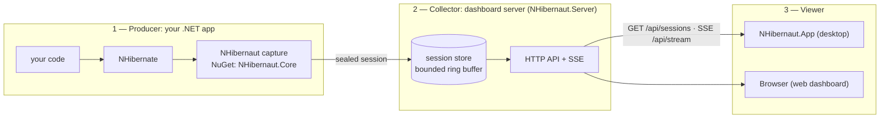

# NHibernaut — Overview

**Start here.** NHibernaut has a few moving parts that live in different processes, and how they
connect is the thing most people want explained first: *which program captures the data, where it is
stored, and how it reaches the screen you are looking at.* This page is the map. For depth, follow the
links — [Architecture](ARCHITECTURE.md) (how capture and the server work internally),
[User Guide](USER_GUIDE.md) (using the dashboard views), [Desktop app](DESKTOP.md) (install + modes),
[HTTP API](API.md) (the wire contract).

All diagrams are [Mermaid](https://mermaid.js.org/) and render natively on GitHub.

---

## The three roles

Whatever your setup, three jobs are always happening. Sometimes two of them share one process — but
they are always distinct jobs:

| Role | Job | What plays it |
|---|---|---|
| **1 — Producer** | Captures what NHibernate does and seals it into sessions | **Your .NET app**, with the NuGet packages (`NHibernaut.Core` [+ `NHibernaut.Server`]) |
| **2 — Collector** | Stores sealed sessions and serves them over HTTP + a live stream | A **dashboard server** (`NHibernaut.Server`) — see [where it can live](#where-the-collector-can-live) |
| **3 — Viewer** | Reads the sessions and draws the UI | The **desktop app** (`NHibernaut.App`) or a **browser** |

> The desktop app's **URL field is simply how the Viewer is told which Collector to read from.**

---

## The journey — from your code to the screen

1. **Capture (Producer).** You add the NuGet packages and turn capture on with one line —
   `cfg.EnableNHibernaut()`. From then on every command NHibernate sends to the database passes
   through NHibernaut, which records the SQL, parameters, timing, rows, and which objects were
   loaded/written. It never changes your app's behavior.
   *(How the hook works: [Architecture §2](ARCHITECTURE.md#2-how-capture-works).)*
2. **Seal + analyze.** When the session's database connection closes, NHibernaut *seals* the session,
   runs its detectors over it (N+1, slow query, unbounded result set, …) and attaches **alerts**.
3. **Store (Collector).** The sealed session lands in an in-memory **ring buffer** — roughly the last
   200 sessions, no database required. Keeping the last N sessions is what makes *compare* and
   *worst-offenders* work with zero persistence.
4. **Serve.** The dashboard server exposes the store over a small HTTP API
   (`GET /api/sessions`, `/api/sessions/{id}`, `/api/aggregate`, …) plus a live **SSE** stream
   (`GET /api/stream`) that pushes each new session the moment it is sealed.
   *(Full contract: [HTTP API](API.md).)*
5. **View (Viewer).** The desktop app — or a browser — connects to that server, pulls the history,
   subscribes to the live stream, and renders the Sessions / Statement / Worst-offenders / Compare
   screens.

**What travels between them** is a *profiled session*: one NHibernate session (unit of work) carrying
every statement it ran (SQL, parameters, timing, rows), its connections and transactions, the objects
it hydrated and wrote, and the alerts analysis attached.
*(Full data model: [Architecture §3](ARCHITECTURE.md#3-data-model).)*

---

## Where the Collector can live

This is the part that surprises people: **"the dashboard server" is not always a separate program.**
The same `NHibernaut.Server` plays the Collector in one of three places — and that choice is exactly
what the Viewer's URL points at:

| Topology | Where the server runs | How Producers reach it | How the Viewer connects | Use when |
|---|---|---|---|---|
| **In-process** *(simplest)* | Inside your app — `NHibernautServer.Start()` | same process (direct) | Viewer URL → `http://127.0.0.1:5005` | Profiling one app on your own machine |
| **Standalone service** | Deployed `NHibernaut.Server.Host` (Windows service / systemd / launchd) | each app calls `RemoteForwarder.Enable(url)` → `POST /api/ingest` | Viewer URL → the service's `host:port` | One central dashboard for many apps |
| **Embedded in the desktop app** | The desktop app hosts the server itself (*Embedded collector* mode) | each app forwards to the desktop's `bind:port` | the desktop app **is** the Collector — no URL to type; you set its bind + port | You want the desktop app to receive sessions directly, with no separate service |

> Forwarding (`RemoteForwarder.Enable`) is fire-and-forget and fail-safe: each sealed session is POSTed
> on a bounded background channel; if the Collector is unreachable, sessions are dropped rather than
> blocking or throwing into your app.
> See [Architecture §7](ARCHITECTURE.md#7-remote-ingestion-centralized-dashboard).

---

## The desktop app's URL field

In the desktop app the **toolbar** shows where you are connected (a read-only label) next to a
**Connection** button. That button opens the **Connection screen**, which is where you actually set the
target:

- **Remote mode** (default) — a **Dashboard URL** box (default `http://127.0.0.1:5005`) and an optional
  **Token** (sent as `X-NHibernaut-Token` when the server requires one). This points the Viewer at an
  *In-process* or *Standalone* Collector.
- **Embedded collector mode** — instead of a URL you set a **Bind address** and **Port**; the desktop
  app starts its own server and your apps forward to it. (Default bind `127.0.0.1` accepts only
  same-machine forwarders; a non-loopback bind requires an auth token — and on Windows a one-time URL
  reservation.)

See [Desktop app → Modes](DESKTOP.md#modes) for the full walkthrough.

---

## Where to go next

- **Use the dashboard views** → [User Guide](USER_GUIDE.md)
- **Install / run the desktop app** → [Desktop app](DESKTOP.md)
- **How capture, sealing, and analysis work inside** → [Architecture](ARCHITECTURE.md)
- **Every option and its default** → [Configuration](CONFIGURATION.md)
- **The HTTP / SSE wire contract** → [HTTP API](API.md)
