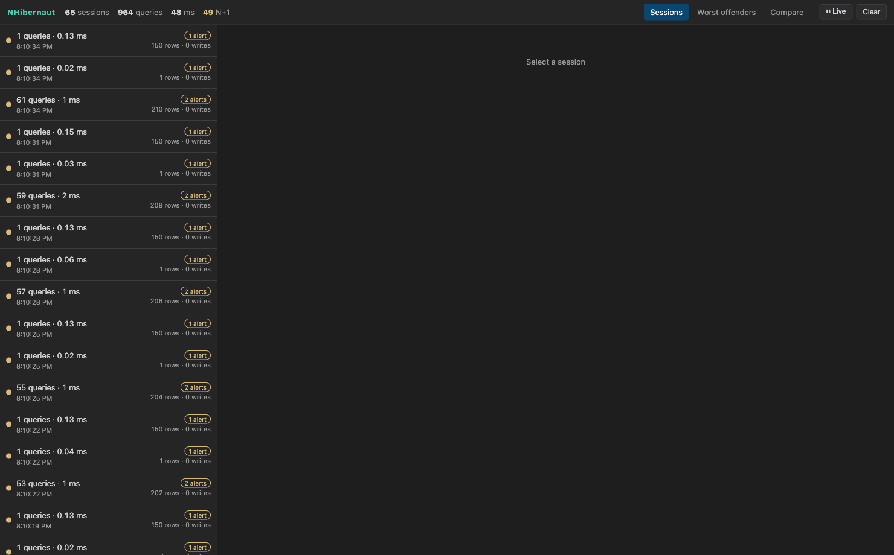
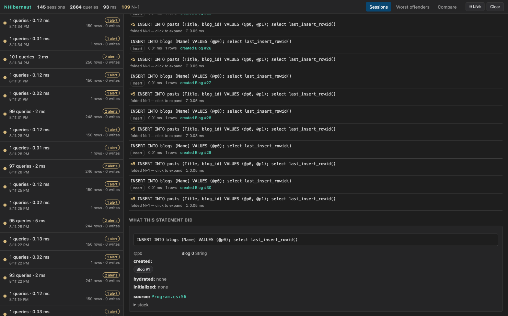
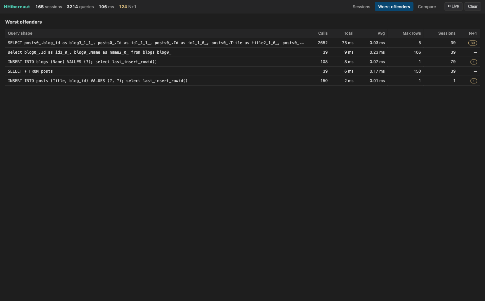
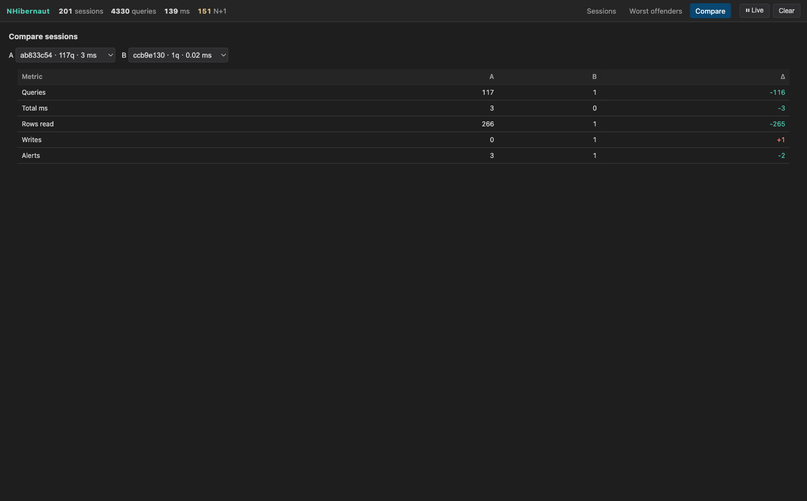

# NHibernaut — User Guide

This guide walks through the NHibernaut dashboard: how to turn it on, and how to use each view to find
and fix data-layer problems in your NHibernate application. The screenshots below come from the
included console sample (`samples/NHibernaut.Sample.Console`), which deliberately generates the kinds
of issues NHibernaut is built to surface.

- New here? See the [README](../README.md) for installation and the full alert catalogue.
- This guide focuses on **using** the dashboard.

---

## 1. Turn it on

Two lines in your existing NHibernate setup:

```csharp
using NHibernaut.Core;     // EnableNHibernaut
using NHibernaut.Server;   // NHibernautServer

cfg.EnableNHibernaut();              // start capturing
var sessionFactory = cfg.BuildSessionFactory();

NHibernautServer.Start();            // dashboard at http://localhost:5005
```

Then open **http://localhost:5005** in your browser. That's it — no separate collector, no changes to
your web stack. (Prefer to mount it on your existing ASP.NET Core server instead? See the *optional
Tier C* section of the [README](../README.md).)

To try it without touching your own app, run the sample:

```bash
dotnet run --project samples/NHibernaut.Sample.Console
# then open http://localhost:5005
```

---

## 2. The session list — triage at a glance

When you open the dashboard you land on the **Sessions** view. Each row is one NHibernate session
(one unit of work). Sessions are sorted **most-severe first**, so the things worth your attention
float to the top.



- **Top bar counters** — total sessions, queries, DB time, and N+1 incidents captured so far.
- **Severity dot** (left of each row) — grey/blue/amber/red for none/info/warning/error.
- **Per-row summary** — query count · duration, the time it ran, an **alert badge** (e.g. `2 alerts`),
  and rows read · writes.
- **Top-right controls** — switch to *Worst offenders* / *Compare*, **pause** the live feed, or
  **clear** the store.

Click any session to open it.

---

## 3. Inside a session — alerts + the waterfall

A selected session leads with its **alerts**, then shows a **waterfall** of every statement, scaled
by start time and duration.


In this session NHibernaut raised three alerts:

- **Select N+1: 160× the same query shape** — the classic ORM trap.
- **Too many queries: 161 in one session.**
- **Unbounded result set** — a SELECT with no row limit returned a large result.

The waterfall makes the N+1 unmistakable: one parent query followed by a **staircase of identical
short bars** — one query per parent row. Each alert carries a plain-English description and a concrete
suggestion (e.g. *“consider eager fetch, a batch-size mapping, or a future/multi-query”*). Clicking an
alert highlights the offending bars on the waterfall.

> Runs of the same query shape are **folded** in the statement list below the waterfall (e.g.
> `×160 SELECT … FROM posts WHERE blog_id = ?`); click to expand the individual executions.

---

## 4. “What did this statement do?” — objects, and jump to the source

Click any statement (a waterfall bar or a row in the statement list) to open the **What this statement
did** panel — the ORM-specific view that a plain SQL profiler can't give you. It shows exactly which
objects each query touched, by **type and primary key** — so you can answer “*which objects were
created?*” at a glance.



The panel shows:

- The **formatted SQL** and its **parameter values** (redactable — see security notes).
- **`created: Blog #1`** / **`updated: …`** / **`deleted: …`** — the entities this statement wrote, by
  type and primary key. (Write statements are also annotated inline in the statement list, e.g.
  `created Blog #1`, so you can see what each INSERT/UPDATE/DELETE produced without clicking.)
- **`hydrated: 160 × Blog (#1, #2, #3 …)`** — exactly which entities (type, count, and keys) this
  statement materialized.
- **`source: Program.cs:NN`** — the first line of *your* code that triggered the query, rendered as a
  **click-to-source** link (`vscode://…` by default) so you can jump straight to it. The full filtered
  stack trace is available under *stack*.

> Click-to-source requires `CaptureStackTraces` (on by default in Development).

---

## 5. Worst offenders — fix systemic problems first

The **Worst offenders** view aggregates every query shape across all captured sessions and ranks them
by total cost. This is the highest-leverage screen for a large codebase: it finds patterns, not just
one slow request.



Columns: **Calls**, **Total** time, **Avg**, **Max rows**, how many **Sessions** used the shape, and
**N+1** incidence. Here the `SELECT … FROM posts WHERE blog_id = ?` shape stands out immediately —
**8,850 calls** for **182 ms total**, flagged as N+1 across 50 sessions. Fixing that one mapping pays
off everywhere it's used.

---

## 6. Compare — prove your fix worked

Pick two sessions of the same shape (for example, the same request **before and after** a fix) and
NHibernaut diffs them.



Here session **A** ran 431 queries; session **B** (after switching to an eager fetch) ran **1** — a
**−430** query delta, with rows read dropping from 580 to 1 and alerts from 3 to 1. Improvements are
shown in green, regressions in red. Because the last N sessions are kept in memory, you can do this
without any persistence or extra setup.

---

## 7. The live feed

The dashboard streams new sessions in real time over Server-Sent Events — as your app does work,
sessions appear at the top of the list and the counters update. Use **⏸ Live / ▶ Paused** in the top
bar to freeze the view while you investigate, and **Clear** to empty the store and start fresh.

---

## 8. Alerts at a glance

| Alert | Severity | What it means |
|---|---|---|
| Select N+1 | Warning | The same query shape (or lazy collection) ran many times in one session. |
| Too many queries | Warning | The session made an unusually large number of round-trips. |
| Unbounded result set | Warning | A SELECT with no limit returned a large result. |
| Too many rows | Warning | A single statement returned a very large result. |
| Too many joins | Info | A statement joins more tables than the threshold. |
| Slow query | Warning | A statement took longer than the threshold. |
| Duplicate query | Info | Identical SQL **and** parameters ran more than once. |
| Cross-thread session | Error | One session was used from more than one thread (unsafe). |
| Write without transaction | Warning | An insert/update/delete ran outside any transaction. |
| Too many writes | Info | The session flushed an unusually large number of writes. |
| Superfluous update | Info | An UPDATE was issued where nothing actually changed. |

All thresholds are configurable on `NHibernautOptions` (see the [README](../README.md)).

---

## 9. Security

The dashboard shows **SQL and parameter values** — treat it as sensitive.

- It binds to **loopback** (`127.0.0.1:5005`) by default. Binding any other address **requires** an
  `AuthToken`, which is then enforced on every request.
- It is hidden in Production by default.
- Disable parameter capture or supply a redactor for PII-sensitive environments.

See the *Security notes* in the [README](../README.md) for the full details.
